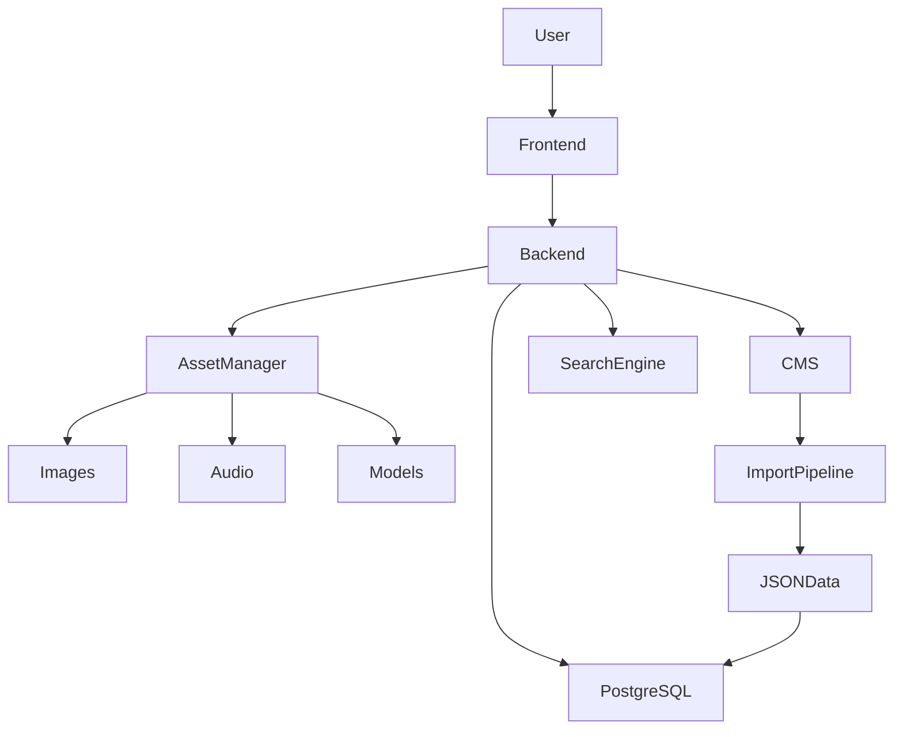

# Project Charter

| Document Information | |
|----------------------|------------------------------------------------|
| Project Name | Pokémon Knowledge Management Platform (PKMP) |
| Project Code | PKMP |
| Version | 1.0.0 |
| Status | Draft |
| Document Type | Project Charter |
| Documentation Standard | IEEE 29148 + Arc42 + C4 + ADR |
| Project Category | Enterprise Web Application |
| Target Platform | Web (Desktop, Tablet, Mobile, PWA) |
| Primary Dataset | Official Pokémon Dataset |
| Secondary Dataset | Clearly Labeled Fan-made Dataset |
| License | Non-commercial Fan Project (Platform Code Separable) |
| Author | Project Owner |
| Last Updated | TBD |

---

# Revision History

| Version | Date | Author | Description |
|----------|------|--------|-------------|
|1.0.0|TBD|Project Owner|Initial Project Charter|

---

# Table of Contents

1. Executive Summary
2. Project Background
3. Business Case
4. Vision Statement
5. Mission Statement
6. Objectives
7. Success Criteria
8. Scope Summary
9. Stakeholders
10. Deliverables
11. High-Level Timeline
12. Risks
13. Assumptions
14. Constraints
15. Technology Stack
16. High-Level Architecture
17. Governance
18. Approval Process
19. References

---

# 1. Executive Summary

## Purpose

The Pokémon Knowledge Management Platform (PKMP) is an enterprise-grade, modular, offline-capable web application designed to become one of the most comprehensive Pokémon knowledge platforms available.

Unlike conventional Pokédex websites that depend on third-party APIs, PKMP maintains its own validated data repository, allowing complete control over data quality, scalability, and future expansion.

The application will combine encyclopedia functionality, content management, advanced search, media management, collection tracking, and community-driven extensions within a single production-ready platform.

---

## Vision in One Sentence

> Build the most complete, maintainable, scalable, and professionally engineered Pokémon knowledge platform while serving as a flagship software engineering portfolio project.

---

# 2. Project Background

Most existing Pokédex websites rely heavily on external APIs, limiting:

- Availability
- Performance
- Data consistency
- Extensibility
- Offline capability
- Version control

Many also focus only on game statistics and omit broader Pokémon media such as:

- Anime
- Manga
- Movies
- Trading Card Game
- Event history
- Official lore

PKMP addresses these limitations by using a self-managed database and a modular architecture that supports future growth.

---

# 3. Business Case

Although developed as a non-commercial fan project, PKMP has strong educational and portfolio value.

### Educational Goals

- Full-stack web development
- Enterprise architecture
- Database engineering
- Search systems
- CMS design
- Software documentation
- DevOps practices
- UI/UX engineering
- Performance optimization
- Security

### Portfolio Goals

Demonstrate proficiency in:

- React
- TypeScript
- Express
- PostgreSQL
- Enterprise architecture
- System design
- Technical writing
- Testing
- Deployment

---

# 4. Vision Statement

To create the definitive Pokémon knowledge platform that combines technical excellence, comprehensive content, modular architecture, and exceptional user experience while remaining maintainable for years to come.

---

# 5. Mission Statement

Develop a production-quality platform that enables users to explore Pokémon information through an intuitive interface, powerful search capabilities, and a robust content management system without relying on external runtime APIs.

---

# 6. Project Objectives

## Primary Objectives

- Create a complete offline-capable Pokédex.
- Cover official Pokémon content comprehensively.
- Support clearly labeled fan-made content.
- Build a scalable modular architecture.
- Provide enterprise-quality documentation.
- Deliver a portfolio-quality application.

## Secondary Objectives

- Progressive Web App support.
- Intelligent search engine.
- Team builder.
- Collection tracking.
- 3D model viewer.
- Theme system.
- Accessibility compliance.

---

# 7. Success Criteria

The project will be considered successful if it:

- Supports all official Pokémon data available at release.
- Operates without runtime dependency on external APIs.
- Achieves responsive performance across major devices.
- Provides modular components suitable for future expansion.
- Includes comprehensive technical documentation.
- Demonstrates production-grade software engineering practices.

---

# 8. Scope Summary

## Included

- Pokémon encyclopedia
- Advanced search
- Intelligent filters
- Team builder
- Compare system
- Collections
- User accounts (optional)
- CMS
- Admin dashboard
- Audit logging
- Import pipeline
- Media management
- Fan-made content management

## Excluded (Initial Release)

- Multiplayer battles
- Online trading
- Real-time chat
- Marketplace
- Mobile native applications

---

# 9. Stakeholders

| Role | Responsibility |
|------|----------------|
| Project Owner | Vision, planning, implementation |
| Contributors (Future) | Feature development |
| Moderators | Fan-made content review |
| Administrators | Platform management |
| End Users | Consume platform features |

---

# 10. Deliverables

### Documentation

- Project Charter
- SRS
- Architecture
- Database Design
- UI/UX
- Security
- Testing
- Deployment
- ADRs

### Software

- Frontend
- Backend
- PostgreSQL Database
- CMS
- Admin Dashboard
- Search Engine
- Asset Pipeline
- PWA

---

# 11. High-Level Timeline

Phase 1 — Planning & Documentation

Phase 2 — Architecture & Database

Phase 3 — Backend Development

Phase 4 — Frontend Development

Phase 5 — CMS & Administration

Phase 6 — Search & Collections

Phase 7 — Testing & Optimization

Phase 8 — Deployment

---

# 12. Risks

| Risk | Impact | Mitigation |
|------|--------|------------|
| Large dataset | High | Modular import pipeline |
| Asset storage | Medium | Organized asset management |
| Scope growth | High | Strict milestone planning |
| Performance | High | Profiling and optimization |
| Documentation maintenance | Medium | Version-controlled docs |

---

# 13. Assumptions

- PostgreSQL is available.
- Modern browsers are used.
- Data sources remain maintainable.
- Static assets can be stored locally.
- Contributors follow documentation standards.

---

# 14. Constraints

- Non-commercial project.
- Pokémon intellectual property remains owned by its respective rights holders.
- No runtime dependency on external APIs.
- Initial implementation focuses exclusively on Pokémon.

---

# 15. Technology Stack

## Frontend

- React
- Vite
- TypeScript
- Tailwind CSS

## Backend

- Node.js
- Express

## Database

- PostgreSQL

## Data Source

- Version-controlled JSON
- Import pipeline

## Rendering

- React Three Fiber
- Three.js

---

# 16. High-Level Architecture

---

# 17. Governance

Major architectural decisions will be documented using Architecture Decision Records (ADRs).

All significant changes require:

- Design review
- Documentation update
- Version increment
- Testing

---

# 18. Approval Process

Each major milestone requires:

1. Documentation review
2. Architecture review
3. Database review
4. Implementation review
5. Testing review

Only after approval does development proceed to the next milestone.

---

# 19. References

- IEEE 29148
- Arc42
- C4 Model
- OWASP ASVS
- WCAG 2.2 AA
- Semantic Versioning
- Conventional Commits

---

# Appendix A – Project Principles

1. Data-driven design.
2. Modular architecture.
3. Separation of concerns.
4. Offline-first where practical.
5. Accessibility by default.
6. Performance-conscious development.
7. Security by design.
8. Comprehensive documentation.
9. Maintainability over shortcuts.
10. Extensibility without major refactoring.