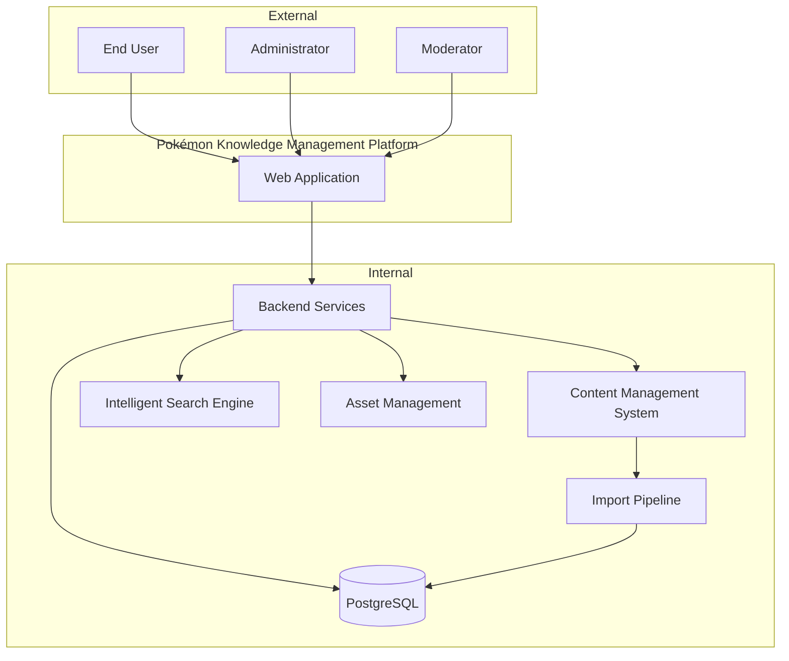

# Project Context

| Document Information | |
|----------------------|------------------------------------------------|
| Document ID | PKMP-CTX-001 |
| Document Name | Project Context |
| Version | 1.0.0 |
| Status | Draft |
| Project | Pokémon Knowledge Management Platform (PKMP) |
| Documentation Standard | IEEE 29148, Arc42, C4 Model |
| Author | Project Owner |
| Last Updated | TBD |

---

# Revision History

| Version | Date | Author | Description |
|----------|------|--------|-------------|
| 1.0.0 | TBD | Project Owner | Initial version |

---

# Table of Contents

1. Introduction
2. Document Purpose
3. Intended Audience
4. Project Background
5. Industry Context
6. Current Ecosystem
7. Problem Statement
8. Project Motivation
9. Vision Alignment
10. Business Context
11. Stakeholder Analysis
12. User Personas
13. Competitive Analysis
14. Opportunity Analysis
15. Project Boundaries
16. Success Metrics
17. High-Level System Context
18. References

---

# 1. Introduction

The Pokémon Knowledge Management Platform (PKMP) is a comprehensive, enterprise-grade web application designed to become one of the most complete Pokémon knowledge platforms available while simultaneously serving as a demonstration of modern software engineering practices.

Rather than functioning as a traditional Pokédex, PKMP is designed as a complete knowledge management platform capable of organizing, searching, managing, and presenting information across every major aspect of the Pokémon franchise.

The platform combines encyclopedia functionality, advanced search, media management, collection tracking, content management, and administrative tooling into a single modular application.

Although the initial release focuses exclusively on Pokémon, the internal architecture is intentionally designed using reusable engineering principles that support long-term evolution without unnecessary complexity during the first implementation.

The project emphasizes software quality as much as application functionality. Every architectural decision is documented before implementation, ensuring that the system remains maintainable, scalable, and understandable throughout its lifecycle.

---

# 2. Document Purpose

This document establishes the context surrounding the project.

It explains:

- Why the project exists.
- Which problems it attempts to solve.
- Which users it targets.
- Why current solutions are insufficient for the project goals.
- Why the selected technologies and architectural style are appropriate.
- How the platform aligns with long-term engineering objectives.

This document intentionally avoids implementation details such as database schemas, API endpoints, component structures, or deployment strategies. Those topics are covered in later documents within the architecture and design sections of the documentation.

---

# 3. Intended Audience

The Project Context document is intended for everyone involved in the project lifecycle.

## Project Owner

The project owner is responsible for defining the vision, planning milestones, reviewing architectural decisions, implementing features, and maintaining documentation.

This document serves as the reference point for ensuring that future development remains aligned with the original objectives.

---

## Developers

Developers require an understanding of the business context before implementing technical solutions.

Understanding *why* a system exists is equally important as understanding *how* it works.

This document provides that background.

---

## Future Contributors

Contributors joining the project at a later stage should be able to understand the project's goals without reading every technical document.

This document acts as the starting point for new contributors.

---

## Reviewers

Recruiters, instructors, interviewers, collaborators, and technical reviewers often evaluate architecture before implementation quality.

This document explains the reasoning behind the project and demonstrates structured planning before development begins.

---

## Community Moderators

Future moderators responsible for reviewing community-submitted content should understand the distinction between official and fan-made datasets and the principles governing content management.

---

## End Users

Although primarily written for developers, this document also communicates the philosophy and long-term direction of the platform to interested users.

---

# 4. Project Background

Since its introduction in 1996, Pokémon has evolved into one of the world's largest multimedia franchises.

Over multiple decades, the franchise has expanded across numerous forms of media including:

- Main series video games
- Spin-off games
- Animated television series
- Feature films
- Manga
- Trading Card Game
- Official strategy guides
- Mobile applications
- Competitive events
- Promotional distributions
- Merchandise
- Community-created content

As the franchise has grown, so has the amount of information associated with individual Pokémon.

A single Pokémon may have:

- Multiple forms
- Regional variants
- Alternate evolutions
- Hundreds of learnable moves
- Different abilities
- Numerous Pokédex entries
- Multiple anime appearances
- Manga appearances
- Movie appearances
- TCG cards
- Event distributions
- Competitive strategies
- Historical gameplay changes across generations

This information is typically distributed across multiple independent websites, each specializing in a particular aspect of the franchise.

Consequently, users frequently switch between several resources when researching a single topic.

PKMP aims to consolidate these fragmented resources into a unified knowledge platform with a consistent user experience.

---

# 5. Industry Context

The majority of Pokémon information websites originated during a period when the primary objective was to publish static reference information.

Over time these projects expanded organically.

While many have become exceptionally comprehensive, their architectures often reflect years of incremental growth rather than deliberate long-term system design.

Modern users increasingly expect applications to provide:

- Fast search
- Responsive interfaces
- Mobile compatibility
- Offline capabilities
- Personal collections
- Advanced filtering
- Rich media integration
- Accessibility
- Cloud synchronization
- Consistent navigation

Meeting these expectations requires architectural planning beyond what many earlier projects were originally designed to support.

PKMP embraces modern engineering practices from the beginning instead of attempting to retrofit them later.

---

# 6. Current Ecosystem

The Pokémon information ecosystem consists of several categories of resources.

## Encyclopedia Websites

These focus primarily on reference information.

Typical characteristics include:

- Pokédex entries
- Game mechanics
- Evolution data
- Move lists
- Ability descriptions

Strengths:

- Comprehensive reference material
- Mature communities
- Large historical archives

Limitations:

- Information fragmentation
- Inconsistent interfaces
- Different terminology
- Variable mobile experience
- Limited personalization

---

## API Services

Several projects expose Pokémon data through APIs.

These services simplify application development by providing structured data.

Strengths:

- Easy integration
- Standardized formats
- Fast development

Limitations:

- External dependency
- Rate limiting
- Schema changes
- Downtime
- Missing specialized information
- Limited control over data quality

PKMP intentionally avoids runtime dependence on external APIs.

Instead, validated datasets become part of the platform itself.

---

## Competitive Battle Resources

These focus primarily on competitive gameplay.

Typical features include:

- Damage calculations
- Competitive tiers
- Team recommendations
- Usage statistics
- Strategy guides

While valuable, these resources generally emphasize battling rather than comprehensive franchise knowledge.

PKMP treats competitive information as one module within a much broader knowledge ecosystem.

---

## Community Wikis

Community-maintained resources often contain extensive historical information.

Their collaborative nature allows rapid expansion.

However, collaborative editing can also produce:

- Inconsistent formatting
- Variable writing quality
- Incomplete verification
- Duplicate information

PKMP adopts structured moderation workflows to maintain consistency while still supporting community participation.

---

# 7. Problem Statement

Despite the availability of many excellent Pokémon resources, several common challenges remain.

## Fragmented Information

Information relevant to a single Pokémon frequently exists across multiple websites.

A user researching one Pokémon may need to visit separate resources for:

- Game mechanics
- Anime appearances
- TCG cards
- Evolution methods
- Competitive strategies
- Lore

This increases cognitive load and disrupts the user experience.

---

## Inconsistent Navigation

Different resources organize information differently.

Users repeatedly learn new navigation systems when switching between websites.

PKMP aims to provide a unified navigation model regardless of content type.

---

## Runtime Dependencies

Applications built directly on external APIs inherit the availability, performance, and maintenance decisions of those APIs.

This creates risks including:

- Service outages
- Rate limits
- Breaking API changes
- Data inconsistencies

Maintaining an internal validated database removes these operational dependencies.

---

## Limited Search Capabilities

Traditional search often supports only:

- Pokémon name
- Pokédex number
- Type

Modern users increasingly expect searches such as:

> "Show every Fire-type Pokémon introduced in Generation III with a Mega Evolution."

Supporting this style of query requires a significantly more sophisticated search architecture.

---

## Limited Extensibility

Many older systems become increasingly difficult to extend because business logic, presentation, and data structures evolve together over time.

Adding new content frequently requires modifying multiple unrelated parts of the application.

PKMP addresses this through clear module boundaries and data-driven design principles.
# 8. Project Motivation

The primary motivation behind PKMP extends beyond creating another Pokédex.

The project is intended to demonstrate how a large-scale knowledge platform can be designed using modern software engineering principles from the beginning rather than evolving through years of incremental modifications.

Most portfolio projects emphasize implementation while giving limited attention to architecture, documentation, maintainability, and long-term scalability.

PKMP intentionally reverses that approach.

The documentation, architecture, and engineering decisions are treated as first-class project deliverables rather than supplementary artifacts.

This approach provides several long-term benefits:

- Consistent development direction.
- Reduced architectural debt.
- Easier onboarding for future contributors.
- Better maintainability.
- Higher software quality.
- Improved testing strategy.
- Professional documentation suitable for enterprise environments.

The project also serves as a practical opportunity to gain experience with topics that are difficult to learn through small applications, including:

- Large relational database design.
- Domain modeling.
- Content management systems.
- Intelligent search systems.
- Enterprise authentication and authorization.
- Asset management.
- Performance optimization.
- Documentation-driven development.
- Software architecture.
- Continuous integration and deployment.
- Production planning.

---

# 9. Vision Alignment

Every major architectural decision should directly support the project's long-term vision.

The following table illustrates how strategic decisions align with the project's objectives.

| Decision | Purpose | Long-Term Benefit |
|----------|---------|-------------------|
| Modular Monolith | Maintain clear module boundaries while avoiding unnecessary distributed complexity | Easier maintenance and future migration to microservices if required |
| PostgreSQL | Strong relational integrity and advanced search capabilities | Reliable long-term data management |
| Fully Normalized Database (3NF) | Minimize duplication and improve consistency | Better maintainability and data integrity |
| Internal Import Pipeline | Own the complete data lifecycle | Independence from third-party APIs |
| Version-Controlled Dataset | Track every change made to the knowledge base | Auditable content history |
| Enterprise CMS | Structured content management | Easier updates across future generations |
| Intelligent Search Engine | Improve information discovery | Superior user experience |
| React + TypeScript | Maintainable frontend architecture | Better reliability and scalability |
| Comprehensive Documentation | Reduce knowledge loss | Long-term sustainability |

Every future feature proposal should be evaluated against these guiding principles.

If a proposed feature conflicts with the long-term vision, its implementation should be reconsidered.

---

# 10. Business Context

PKMP is developed as a non-commercial fan project.

Its primary objectives are educational, technical, and community-oriented rather than financial.

Although the application will not generate direct commercial revenue, it creates value in several areas.

## Educational Value

The project serves as a comprehensive learning experience covering multiple software engineering disciplines.

Examples include:

- Software Architecture
- Database Engineering
- Full Stack Development
- API Design
- Security
- UI/UX Design
- Documentation
- Testing
- DevOps
- Performance Engineering

Few personal projects provide opportunities to integrate all of these disciplines within a single coherent system.

---

## Portfolio Value

The project demonstrates practical experience beyond individual programming languages.

It showcases the ability to:

- Analyze requirements.
- Plan large systems.
- Design scalable architectures.
- Document engineering decisions.
- Build maintainable software.
- Manage long-term technical complexity.

This provides stronger evidence of engineering capability than isolated coding exercises.

---

## Community Value

Many Pokémon fans use multiple resources daily.

A unified platform can reduce fragmentation while offering a consistent experience.

Future community contributions can improve the platform through:

- Fan-made content.
- Documentation improvements.
- Data corrections.
- Localization.
- Feature suggestions.

---

## Engineering Value

The project acts as an experimental platform for exploring:

- Search optimization.
- PostgreSQL indexing.
- Full-text search.
- Content workflows.
- Data validation.
- Import automation.
- Asset pipelines.
- Performance benchmarking.

---

# 11. Stakeholder Analysis

Although initially developed by a single developer, the platform should be designed with multiple stakeholder groups in mind.

## Primary Stakeholders

### Project Owner

Responsibilities include:

- Product vision.
- Architecture.
- Development.
- Documentation.
- Release planning.
- Quality assurance.
- Long-term maintenance.

The project owner has final authority over technical and architectural decisions.

---

### End Users

End users are the primary consumers of the platform.

Typical objectives include:

- Searching Pokémon.
- Learning game mechanics.
- Exploring franchise history.
- Tracking collections.
- Building teams.
- Comparing Pokémon.

The platform should prioritize usability and information accessibility.

---

### Contributors

Future contributors may assist with:

- Development.
- Bug fixes.
- Documentation.
- Testing.
- Localization.
- Dataset improvements.

Documentation should minimize onboarding time.

---

### Moderators

Moderators manage community-generated content.

Responsibilities include:

- Reviewing submissions.
- Approving fan-made entries.
- Preventing duplicate content.
- Ensuring quality standards.

Official and fan-made content must remain clearly separated.

---

### Administrators

Administrators oversee platform operations.

Responsibilities include:

- User management.
- Permission management.
- Content publishing.
- Audit review.
- Backup management.
- Import approval.

---

# 12. User Personas

Understanding different user groups helps ensure the platform addresses real needs rather than assumed requirements.

## Persona 1 — Casual Fan

### Goals

- Learn about Pokémon.
- Browse artwork.
- Read evolution information.
- Explore regions.
- Discover anime appearances.

### Technical Experience

Low to moderate.

### Primary Devices

- Smartphone.
- Tablet.
- Laptop.

### Expectations

- Simple navigation.
- Attractive interface.
- Fast loading.
- Easy search.

---

## Persona 2 — Competitive Player

### Goals

- Compare stats.
- Study abilities.
- Explore move pools.
- Build teams.
- Analyze type matchups.

### Technical Experience

High.

### Expectations

- Powerful filters.
- Fast performance.
- Detailed statistics.
- Accurate data.

---

## Persona 3 — Collector

### Goals

- Track owned Pokémon.
- Build a Living Dex.
- Record shiny collections.
- Track regional forms.
- Organize achievements.

### Expectations

- Personal collections.
- Progress tracking.
- Cloud synchronization (optional).
- Export capabilities.

---

## Persona 4 — Researcher

Examples include:

- Content creators.
- Wiki editors.
- Students.
- Developers.
- Pokémon enthusiasts.

Goals include:

- Finding detailed information quickly.
- Cross-referencing multiple data categories.
- Exporting structured information.
- Accessing historical data.

This group benefits most from advanced search and structured datasets.

---

## Persona 5 — Administrator

Goals include:

- Managing datasets.
- Publishing updates.
- Reviewing content.
- Monitoring system health.
- Maintaining data quality.

The administrative interface prioritizes efficiency, traceability, and reliability over visual presentation.

---

# 13. Competitive Analysis

PKMP is not intended to replace existing Pokémon resources.

Instead, it aims to learn from their strengths while addressing common limitations.

The following analysis focuses on architectural and functional characteristics rather than popularity.

| Category | Common Strengths | Common Limitations | PKMP Objective |
|----------|------------------|-------------------|----------------|
| Encyclopedia Websites | Comprehensive reference data | Information fragmentation | Unified knowledge platform |
| API Services | Easy integration | External dependency | Self-managed data lifecycle |
| Community Wikis | Rapid content growth | Variable consistency | Structured moderation workflows |
| Competitive Resources | Excellent battle analysis | Limited franchise coverage | Integrate competitive data as one module |
| Official Sources | Authoritative information | Limited historical search | Unified historical archive |

Rather than competing solely on content volume, PKMP differentiates itself through engineering quality, integrated user experience, intelligent search, structured documentation, and maintainable architecture.
# 14. Opportunity Analysis

The Pokémon franchise continues to expand through new generations, games, regional forms, battle mechanics, anime series, movies, trading card expansions, and special events.

Each expansion increases both the amount of available information and the complexity of organizing it.

This creates an opportunity to design a platform that is not simply a static encyclopedia but a structured knowledge management system capable of evolving alongside the franchise.

PKMP is positioned to address several opportunities simultaneously.

## 14.1 Unified Knowledge Platform

Rather than treating each category of information independently, PKMP integrates all official Pokémon-related knowledge into a single platform.

Examples include:

- Pokémon
- Forms
- Evolutions
- Types
- Abilities
- Moves
- Items
- Regions
- Games
- Anime
- Manga
- Movies
- Trading Card Game
- Characters
- Organizations
- Locations
- Lore
- Event Distributions
- Competitive Information
- Fan-made Content

This unified approach reduces context switching and creates a consistent user experience.

---

## 14.2 Offline-First Experience

Many Pokémon applications depend on continuous internet connectivity because they retrieve information from external services.

PKMP stores its data locally within its own database, allowing the application to:

- Minimize runtime dependencies.
- Improve response times.
- Increase reliability.
- Support Progressive Web App (PWA) features.
- Continue functioning during temporary network interruptions.

Offline capability becomes increasingly valuable for mobile users and demonstrations.

---

## 14.3 Data Ownership

Owning the complete data lifecycle enables capabilities that are difficult to achieve when relying on third-party APIs.

These capabilities include:

- Schema evolution.
- Data validation.
- Historical version tracking.
- Bulk imports.
- Audit logs.
- Rollback support.
- Custom metadata.
- Internal identifiers.
- Dataset consistency checks.

This provides long-term flexibility as future generations and mechanics are introduced.

---

## 14.4 Intelligent Search

Search becomes significantly more valuable when it understands relationships rather than simple keywords.

Examples include:

- Finding Pokémon by evolution method.
- Searching by multiple abilities.
- Filtering by region and generation simultaneously.
- Discovering Pokémon appearing in a specific movie.
- Finding every Pokémon capable of learning a particular move.
- Combining multiple search criteria naturally.

The search engine therefore becomes one of the platform's core capabilities rather than an auxiliary feature.

---

## 14.5 Long-Term Maintainability

Many fan projects become difficult to maintain because their internal architecture grows organically.

PKMP adopts structured engineering practices from the beginning, including:

- Documentation-driven development.
- Modular architecture.
- Strong typing.
- Layered responsibilities.
- Database normalization.
- Version control.
- Coding standards.
- Architecture Decision Records.

These practices reduce technical debt and improve long-term sustainability.

---

# 15. Project Boundaries

Clearly defining project boundaries prevents uncontrolled scope expansion and provides realistic development milestones.

The following sections describe what is included and excluded within the initial implementation.

## 15.1 In Scope

The first major release includes the following capabilities.

### Knowledge Management

- Complete Pokédex
- Regional Forms
- Mega Evolutions
- Gigantamax Forms
- Paradox Pokémon
- Ultra Beasts
- Mythical Pokémon
- Legendary Pokémon
- Fan-made Pokémon (clearly identified)

---

### Encyclopedia Modules

- Moves
- Abilities
- Items
- Types
- Egg Groups
- Natures
- Regions
- Games
- Anime
- Manga
- Movies
- TCG
- Characters
- Locations
- Organizations

---

### User Features

- Intelligent Search
- Advanced Filters
- Favorites
- Personal Collections
- Living Dex
- Team Builder
- Pokémon Comparison
- Theme Selection
- Responsive Design

---

### Administrative Features

- CMS
- User Management
- Role-Based Access Control
- Import Pipeline
- Dataset Validation
- Version Management
- Audit Logging
- Moderation Workflow

---

### Technical Features

- Progressive Web App
- Responsive Interface
- Accessibility Support
- High Performance
- Modular Architecture
- REST API
- Comprehensive Documentation

---

## 15.2 Out of Scope

The following features are intentionally excluded from the first major release.

### Multiplayer Gameplay

Examples include:

- Online Battles
- Trading
- Matchmaking
- Friend Lists

These features require infrastructure beyond the project's current objectives.

---

### Marketplace

Buying, selling, or exchanging digital assets is outside the project's scope.

---

### Native Mobile Applications

The first release targets modern web browsers.

A Progressive Web App provides sufficient mobile functionality.

Native Android or iOS applications may be considered in future releases.

---

### Artificial Intelligence Features

The platform will support intelligent searching through structured parsing and ranking algorithms.

Large Language Models, chatbots, and generative AI are intentionally excluded from the initial implementation to avoid unnecessary complexity.

However, extension points may be designed for future integration.

---

### Commercial Services

The platform will not include:

- Paid subscriptions.
- Advertisements.
- Premium memberships.
- Microtransactions.

The project remains educational and non-commercial.

---

# 16. Success Metrics

Project success should be evaluated using measurable engineering objectives rather than subjective impressions.

## Functional Success

The platform should:

- Support all officially released Pokémon.
- Support future Pokémon without structural redesign.
- Store all core franchise information.
- Operate independently of runtime third-party APIs.

---

## Performance Success

Target performance goals include:

| Metric | Target |
|---------|--------|
| Initial Page Load | < 2 seconds (cached) |
| Search Response | < 200 ms |
| API Response Time | < 300 ms (average) |
| Database Query Time | < 100 ms for common operations |
| Lighthouse Performance Score | 90+ |
| Lighthouse Accessibility Score | 95+ |
| Lighthouse Best Practices | 95+ |
| Lighthouse SEO | 90+ |

These targets serve as engineering goals rather than absolute guarantees and may be refined during performance testing.

---

## Documentation Success

The documentation should:

- Cover every major architectural decision.
- Remain synchronized with implementation.
- Be understandable by new contributors.
- Follow consistent formatting.
- Include diagrams where appropriate.
- Minimize undocumented assumptions.

Documentation is treated as a core deliverable rather than supplementary material.

---

## Code Quality Success

The implementation should emphasize:

- Readability.
- Testability.
- Maintainability.
- Consistency.
- Strong typing.
- Low coupling.
- High cohesion.
- Predictable module boundaries.

Quality should take precedence over implementation speed.

---

## User Experience Success

Users should be able to:

- Find information quickly.
- Navigate intuitively.
- Build collections easily.
- Access information across devices.
- Understand advanced features without extensive documentation.

The interface should remain approachable despite the large amount of available information.

---

# 17. High-Level System Context

The following C4 Level 1 context diagram illustrates the relationship between users and the PKMP platform.

The detailed C4 Container, Component, and Code diagrams are documented in:

- `docs/02_Architecture/System_Architecture.md`
- `docs/02_Architecture/Backend_Architecture.md`
- `docs/02_Architecture/Frontend_Architecture.md`

---

# 18. References

## Internal Documents

- `README.md`
- `00_Project_Charter.md`
- `02_Vision_and_Goals.md`
- `03_Project_Scope.md`

## Standards

- IEEE 29148 – Requirements Engineering
- Arc42 Architecture Documentation
- C4 Model for Software Architecture
- OWASP ASVS
- WCAG 2.2 AA
- Semantic Versioning 2.0.0
- Conventional Commits Specification