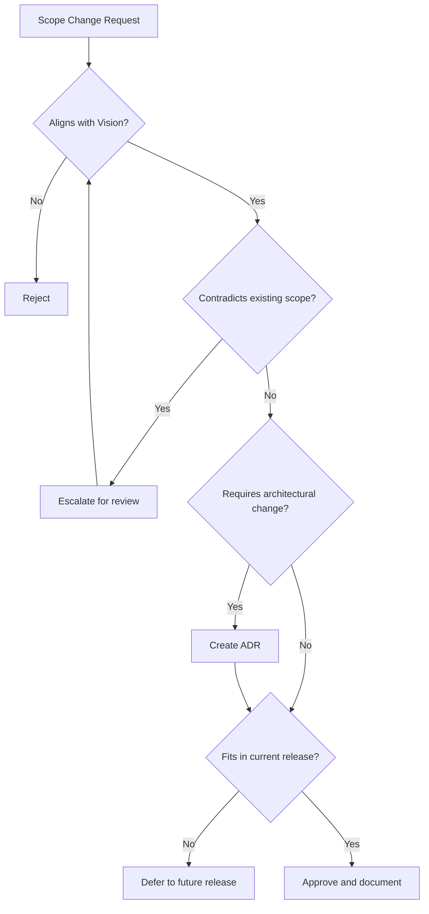
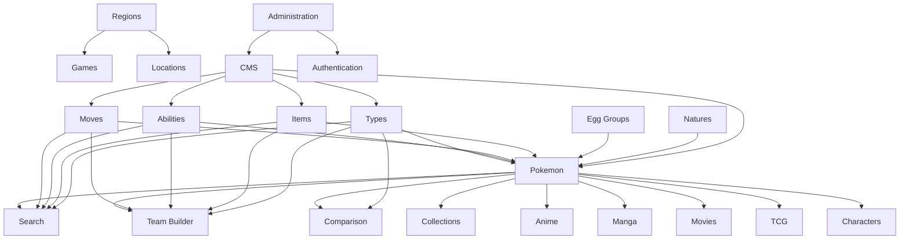

# Project Scope

| Document Information | |
|----------------------|------------------------------------------------|
| Document ID | PKMP-SC-001 |
| Document Name | Project Scope |
| Version | 1.0.0 |
| Status | Draft |
| Documentation Standard | IEEE 29148 + Arc42 |
| Author | Project Owner |
| Last Updated | TBD |

---

# Revision History

| Version | Date | Author | Description |
|----------|------|--------|-------------|
| 1.0.0 | TBD | Project Owner | Initial version |

---

# Table of Contents

1. Introduction
2. Scope Definition Approach
3. Platform Modules
4. Module Scope Matrix
5. Content Categories
6. User-Facing Features
7. Administrative Features
8. Technical Scope
9. Out of Scope
10. Scope Boundaries
11. Scope Change Management
12. Module Dependency Map
13. Content Volume Estimates
14. Acceptance Criteria
15. References

---

# 1. Introduction

This document defines the boundaries of the Pokémon Knowledge Management Platform (PKMP) for its first major release (v1.0.0).

The Project Charter establishes what the project is. The Project Context explains why the project exists. The Vision and Goals document defines where the project is heading. This document defines precisely what is included, what is excluded, and how scope changes are managed.

Every feature request, bug fix, and architectural change should be evaluated against the boundaries defined here.

Scope control is critical for a project of this scale. Without explicit boundaries, knowledge management platforms tend toward unbounded growth. This document prevents that by establishing clear inclusion and exclusion criteria for every major subsystem.

---

# 2. Scope Definition Approach

Scope is defined at three levels of granularity.

## 2.1 Module Level

Each platform module represents a major functional area. Modules have clearly defined responsibilities and boundaries.

A module is in scope if it appears in the Module Scope Matrix (Section 4) with a release target of v1.0.0.

---

## 2.2 Feature Level

Within each module, individual features are enumerated and categorized.

Features are classified as:

| Classification | Definition |
|----------------|------------|
| Core | Required for v1.0.0 release. The module is incomplete without this feature. |
| Enhanced | Improves the module but is not required for initial release. May be deferred. |
| Future | Planned for a later release. Explicitly excluded from v1.0.0. |

---

## 2.3 Content Level

Content scope defines which Pokémon franchise data categories are included in the initial dataset.

Content categories are independent of module features. A module may exist without full content coverage, and content may be imported before the corresponding module is implemented.

---

# 3. Platform Modules

The platform is organized into the following modules.

## 3.1 Pokémon Module

The primary encyclopedia module. Provides detailed information about every officially released Pokémon.

### Core Data

- National Pokédex entry
- Regional Pokédex entries
- Base stats (HP, Attack, Defense, Sp. Atk, Sp. Def, Speed)
- Types (primary, secondary)
- Abilities (normal, hidden)
- Evolution chains and methods
- Egg groups
- Growth rate
- Catch rate
- Base experience
- Gender ratio
- Height and weight
- Generation of introduction
- Classification (species descriptor)

### Forms and Variants

- Regional forms (Alolan, Galarian, Hisuian, Paldean)
- Mega Evolutions
- Gigantamax forms
- Paradox Pokémon
- Ultra Beasts
- Primal Reversions
- Alternate forms (Rotom, Deoxys, Castform, etc.)
- Gender differences (visual)
- Shiny variants (metadata, not necessarily unique assets for all)

### Relationships

- Evolution chains (linear, branching, conditional)
- Type effectiveness (offensive, defensive)
- Learnable moves (level-up, TM, HM, TR, egg, tutor, event)
- Ability associations
- Egg group memberships
- Held item associations
- Pokédex entries across games

### Media References

- Primary artwork
- Sprite history across generations
- 3D model references (where available)
- Cry audio references
- Anime appearances (episode references)
- Movie appearances
- Manga appearances
- TCG card references

---

## 3.2 Moves Module

Complete move encyclopedia.

### Core Data

- Move name
- Type
- Category (Physical, Special, Status)
- Power
- Accuracy
- PP (Power Points)
- Priority
- Target type
- Generation introduced
- Description

### Extended Data

- Effect description
- Effect chance
- Stat changes
- Status conditions inflicted
- Critical hit rate modifier
- Contact flag
- Sound-based flag
- Punch-based flag
- Z-Move equivalents
- Max Move equivalents
- Contest category and appeal (where applicable)

### Relationships

- Pokémon that learn this move (by method)
- Type associations
- Move category groupings

---

## 3.3 Abilities Module

Complete ability encyclopedia.

### Core Data

- Ability name
- Description
- Generation introduced
- Is hidden ability flag

### Extended Data

- In-battle effect
- Overworld effect (if applicable)
- Interactions with other abilities
- Interactions with specific moves
- Interactions with weather conditions
- Interactions with terrain

### Relationships

- Pokémon with this ability (normal slot, hidden slot)
- Generation availability changes

---

## 3.4 Items Module

Complete item encyclopedia.

### Core Data

- Item name
- Category (Poké Ball, Medicine, Berry, Hold Item, Key Item, TM, TR, etc.)
- Description
- Generation introduced
- Buy price
- Sell price

### Extended Data

- Effect description
- Fling power and effect
- Natural Gift type and power (for Berries)
- Berry growth data (for Berries)

### Relationships

- Pokémon that can hold this item
- Evolution triggers involving this item
- Moves affected by this item

---

## 3.5 Types Module

Type system and effectiveness data.

### Core Data

- Type name
- Generation introduced
- Color association

### Type Effectiveness

- Offensive matchups (super effective, not very effective, no effect)
- Defensive matchups
- Dual-type effectiveness calculations
- Historical changes across generations (e.g., Dark/Steel introduction in Gen II, Fairy introduction in Gen VI)

### Relationships

- Pokémon of this type
- Moves of this type
- Type-related abilities

---

## 3.6 Natures Module

### Core Data

- Nature name
- Increased stat
- Decreased stat
- Favorite flavor
- Disliked flavor
- Neutral natures identified

---

## 3.7 Egg Groups Module

### Core Data

- Egg group name
- Description

### Relationships

- Pokémon in this egg group
- Breeding compatibility matrix

---

## 3.8 Regions Module

### Core Data

- Region name
- Generation
- Based on (real-world inspiration)
- Professor
- Starter Pokémon

### Locations

- Routes
- Cities and towns
- Dungeons and caves
- Legendary locations
- Special areas

### Relationships

- Games set in this region
- Pokémon native to this region
- Gym leaders and Elite Four

---

## 3.9 Games Module

### Core Data

- Game title
- Generation
- Platform
- Release date (by region)
- Region(s) featured
- Version group

### Extended Data

- New Pokémon introduced
- New mechanics introduced
- Pokédex availability
- Exclusive Pokémon (version exclusives)

---

## 3.10 Anime Module

### Core Data

- Series title
- Season
- Episode count
- Region covered
- Air dates

### Episode Data

- Episode number
- Episode title
- Air date
- Synopsis
- Featured Pokémon
- Key characters

---

## 3.11 Manga Module

### Core Data

- Series title
- Author
- Volumes
- Chapters
- Region/arc

---

## 3.12 Movies Module

### Core Data

- Movie title
- Release year
- Release date (by region)
- Featured Legendary/Mythical Pokémon
- Synopsis

---

## 3.13 TCG Module

### Core Data

- Set name
- Release date
- Total cards
- Set symbol

### Card Data

- Card name
- Card number
- Rarity
- Type
- HP
- Attacks
- Weakness
- Resistance
- Retreat cost
- Artist
- Pokémon reference

---

## 3.14 Characters Module

### Core Data

- Character name
- Category (Trainer, Gym Leader, Elite Four, Champion, Professor, Villain, Rival)
- Region
- Game appearances
- Anime appearances
- Pokémon team

---

## 3.15 Locations Module

### Core Data

- Location name
- Region
- Location type (City, Town, Route, Cave, Forest, Building, etc.)
- Game appearances
- Available Pokémon (encounter data)
- Notable NPCs

---

## 3.16 Search Module

Intelligent search engine supporting structured queries, natural language parsing, fuzzy matching, and ranked results.

### Core Capabilities

- Keyword search across all modules
- Type-based filtering
- Generation filtering
- Stat range filtering
- Multi-criteria combination
- Fuzzy matching via `pg_trgm`
- Full-text search via PostgreSQL `tsvector`/`tsquery`
- Synonym dictionary support
- Autocomplete suggestions
- Search result ranking by relevance

### Advanced Capabilities

- Natural language query parsing (e.g., "Fire-type Pokémon from Generation III with Mega Evolution")
- Cross-module search (find Pokémon by move, ability, region, game appearance)
- Saved searches (authenticated users)
- Search history (authenticated users)
- Search analytics (admin)

---

## 3.17 Team Builder Module

### Core Features

- Create teams of up to 6 Pokémon
- Assign moves, abilities, items, natures, EVs, IVs
- Type coverage analysis
- Weakness/resistance summary
- Save teams (authenticated users)
- Share teams via URL

### Enhanced Features (v1.0.0 target)

- Duplicate detection
- Move coverage visualization
- Stat comparison within team

---

## 3.18 Comparison Module

### Core Features

- Compare 2–6 Pokémon side by side
- Stat comparison with visualization
- Type comparison
- Ability comparison
- Move pool overlap analysis
- Evolution comparison

---

## 3.19 Collections Module

### Core Features

- Living Dex tracker
- Shiny collection tracker
- Favorites list
- Regional form tracker
- Per-game completion tracker

### Data Persistence

- Local storage for unauthenticated users
- Server-side storage for authenticated users
- Optional cloud synchronization

---

## 3.20 CMS Module

Enterprise content management system for managing all platform content.

### Core Features

- Dataset import pipeline (JSON → validated → PostgreSQL)
- Import validation with detailed error reporting
- Content versioning
- Publish/unpublish workflow
- Bulk import operations
- Rollback support

### Moderation Features

- Community content submission queue
- Moderator review workflow
- Approval/rejection with comments
- Official vs. fan-made content separation enforced at schema level

### Audit Features

- All content modifications logged
- Audit trail with user, timestamp, operation, before/after values
- Audit log search and filtering (admin)

---

## 3.21 Administration Module

### User Management

- User registration and authentication (JWT + refresh tokens)
- Role-Based Access Control (RBAC)
- Roles: Guest, User, Moderator, Editor, Admin, Super Admin
- Permission management
- Account suspension/deactivation

### Platform Management

- Dashboard with system metrics
- Import job monitoring
- Error log viewer
- Database health indicators
- Cache management

---

# 4. Module Scope Matrix

| Module | v1.0.0 | Classification | Dependencies |
|--------|--------|----------------|--------------|
| Pokémon | ✅ | Core | Types, Abilities, Moves, Items, Egg Groups, Natures |
| Moves | ✅ | Core | Types, Pokémon |
| Abilities | ✅ | Core | Pokémon |
| Items | ✅ | Core | Pokémon |
| Types | ✅ | Core | None |
| Natures | ✅ | Core | None |
| Egg Groups | ✅ | Core | Pokémon |
| Regions | ✅ | Core | Games, Locations |
| Games | ✅ | Core | Regions |
| Anime | ✅ | Enhanced | Pokémon, Characters |
| Manga | ✅ | Enhanced | Pokémon, Characters |
| Movies | ✅ | Enhanced | Pokémon, Characters |
| TCG | ✅ | Enhanced | Pokémon |
| Characters | ✅ | Enhanced | Pokémon, Regions, Games |
| Locations | ✅ | Enhanced | Regions, Pokémon |
| Search | ✅ | Core | All content modules |
| Team Builder | ✅ | Core | Pokémon, Moves, Abilities, Items, Types |
| Comparison | ✅ | Core | Pokémon, Types |
| Collections | ✅ | Core | Pokémon |
| CMS | ✅ | Core | All content modules |
| Administration | ✅ | Core | CMS, Authentication |

All modules are targeted for v1.0.0. Core modules must be complete before release. Enhanced modules may ship with partial content coverage.

---

# 5. Content Categories

## 5.1 Official Content

Official content originates from The Pokémon Company, Game Freak, Nintendo, or affiliated entities.

Official content includes:

- Game data (stats, moves, abilities, items, types, etc.)
- Anime episode data
- Movie data
- Manga chapter data
- TCG set and card data
- Event distribution data
- Character and location data
- Lore and world-building information

Official content is imported through the validated import pipeline and stored with `source_type = 'official'` in the database.

---

## 5.2 Fan-Made Content

Fan-made content is community-submitted material clearly separated from official data.

Fan-made content includes:

- Custom Pokémon (Fakemon)
- Fan-created regions
- Custom moves and abilities
- Fan art (with attribution)
- Custom teams and strategies
- Community guides

Fan-made content is stored with `source_type = 'community'` and passes through the moderation workflow before publication.

Fan-made content never appears in official search results unless the user explicitly enables community content filters.

---

## 5.3 Content Separation Enforcement

| Mechanism | Purpose |
|-----------|---------|
| Database column `source_type` | Schema-level separation |
| Default query filters | Exclude community content unless opted in |
| UI labels and badges | Visual distinction on all community content |
| Separate import pipelines | Different validation rules for official vs. community |
| Moderation workflow | Community content requires approval |

---

# 6. User-Facing Features

## 6.1 Feature Scope Matrix

| Feature | Classification | Module | Authentication Required |
|---------|----------------|--------|------------------------|
| Browse Pokédex | Core | Pokémon | No |
| View Pokémon detail | Core | Pokémon | No |
| Browse moves | Core | Moves | No |
| Browse abilities | Core | Abilities | No |
| Browse items | Core | Items | No |
| Type effectiveness chart | Core | Types | No |
| Search (basic) | Core | Search | No |
| Search (advanced filters) | Core | Search | No |
| Search (natural language) | Enhanced | Search | No |
| Autocomplete | Core | Search | No |
| Compare Pokémon | Core | Comparison | No |
| Team Builder | Core | Team Builder | No (save requires auth) |
| Living Dex tracker | Core | Collections | Yes |
| Shiny tracker | Core | Collections | Yes |
| Favorites | Core | Collections | Yes |
| Browse anime | Enhanced | Anime | No |
| Browse manga | Enhanced | Manga | No |
| Browse movies | Enhanced | Movies | No |
| Browse TCG | Enhanced | TCG | No |
| Browse regions | Core | Regions | No |
| Browse games | Core | Games | No |
| Dark mode | Core | UI | No |
| Responsive layout | Core | UI | No |
| PWA install | Enhanced | UI | No |
| User registration | Core | Auth | N/A |
| User login | Core | Auth | N/A |
| Profile management | Core | Auth | Yes |
| Cloud sync | Enhanced | Collections | Yes |
| Export collections | Enhanced | Collections | Yes |
| Submit fan content | Enhanced | CMS | Yes |
| View community content | Enhanced | CMS | No (opt-in filter) |

---

# 7. Administrative Features

## 7.1 Admin Feature Scope Matrix

| Feature | Classification | Role Required |
|---------|----------------|---------------|
| Admin dashboard | Core | Admin |
| User management | Core | Admin |
| Role management | Core | Super Admin |
| Dataset import | Core | Editor, Admin |
| Import validation | Core | Editor, Admin |
| Content publish/unpublish | Core | Editor, Admin |
| Content versioning | Core | Editor, Admin |
| Rollback | Core | Admin |
| Moderation queue | Core | Moderator, Admin |
| Audit log viewer | Core | Admin |
| System health dashboard | Enhanced | Admin |
| Cache management | Enhanced | Admin |
| Search analytics | Enhanced | Admin |
| Bulk operations | Enhanced | Admin |
| Export database | Enhanced | Super Admin |

---

# 8. Technical Scope

## 8.1 Technology Decisions

| Area | Decision | Rationale |
|------|----------|-----------|
| Frontend Framework | React 19 | Component model, ecosystem, TypeScript support |
| Build Tool | Vite | Fast HMR, optimized production builds |
| Language | TypeScript | Type safety across frontend and backend |
| Styling | Tailwind CSS v4 | Design tokens, utility-first, dark mode support |
| Client Routing | TanStack Router | Type-safe routes, code splitting |
| Server State | TanStack Query | Caching, background refetch, optimistic updates |
| Form Management | React Hook Form + Zod | Performant forms with runtime validation |
| 3D Rendering | React Three Fiber | Declarative Three.js for Pokémon models |
| Backend Framework | NestJS | Modular architecture, dependency injection, TypeScript |
| ORM | Prisma | Type-safe queries, schema-driven migrations |
| Database | PostgreSQL | ACID, full-text search, `pg_trgm`, JSON support |
| Authentication | JWT + Refresh Tokens | Stateless auth with secure rotation |
| Authorization | RBAC | Role-based permission system |
| API Style | REST | Established conventions, broad tooling support |
| Documentation | Markdown + Mermaid | Version-controlled, renderable diagrams |

---

## 8.2 Infrastructure Scope (v1.0.0)

| Component | In Scope | Notes |
|-----------|----------|-------|
| Docker containerization | ✅ | Development and production |
| CI/CD pipeline | ✅ | GitHub Actions |
| PostgreSQL hosting | ✅ | Single instance |
| Static asset serving | ✅ | CDN for production |
| Environment configuration | ✅ | `.env` based |
| SSL/TLS | ✅ | Required for production |
| Horizontal scaling | ❌ | Future consideration |
| Kubernetes | ❌ | Future consideration |
| Multi-region deployment | ❌ | Future consideration |
| Message queues | ❌ | Future consideration |
| Microservice extraction | ❌ | Future consideration |

---

## 8.3 Browser Support

| Browser | Minimum Version |
|---------|----------------|
| Chrome | Last 2 major versions |
| Firefox | Last 2 major versions |
| Safari | Last 2 major versions |
| Edge | Last 2 major versions |
| Mobile Chrome | Last 2 major versions |
| Mobile Safari | Last 2 major versions |

Internet Explorer is not supported.

---

# 9. Out of Scope

The following features are explicitly excluded from v1.0.0.

## 9.1 Multiplayer and Social

| Feature | Reason for Exclusion |
|---------|---------------------|
| Online battles | Requires real-time infrastructure beyond project objectives |
| Pokémon trading | Requires transaction management and trust systems |
| Friend lists | Social features are outside initial scope |
| Chat | Requires moderation infrastructure |
| Forums | Community discussion is outside initial scope |
| Leaderboards | Requires competitive scoring systems |

---

## 9.2 Commerce

| Feature | Reason for Exclusion |
|---------|---------------------|
| Paid subscriptions | Non-commercial project |
| Advertisements | Conflicts with user experience goals |
| Premium features | All features are freely available |
| Microtransactions | Non-commercial project |
| Merchandise store | Outside project scope |

---

## 9.3 Native Applications

| Feature | Reason for Exclusion |
|---------|---------------------|
| iOS native app | PWA provides sufficient mobile experience for v1.0.0 |
| Android native app | PWA provides sufficient mobile experience for v1.0.0 |
| Desktop application | Web application is the primary target |

Native applications may be considered for future releases if user demand justifies the development effort.

---

## 9.4 AI and Machine Learning

| Feature | Reason for Exclusion |
|---------|---------------------|
| LLM-powered chatbot | Unnecessary complexity for structured knowledge retrieval |
| AI team recommendations | Algorithmic approach is sufficient for v1.0.0 |
| Image recognition | Outside project objectives |
| Generative content | Conflicts with data accuracy goals |

The search engine uses structured query parsing and PostgreSQL full-text search rather than machine learning models. Extension points for future AI integration may be designed but not implemented.

---

## 9.5 Advanced Infrastructure

| Feature | Reason for Exclusion |
|---------|---------------------|
| Kubernetes orchestration | Single-instance deployment is sufficient for v1.0.0 |
| Multi-region deployment | Not required for initial user base |
| Message queue systems | Synchronous processing is acceptable for v1.0.0 import volumes |
| GraphQL API | REST provides sufficient functionality; GraphQL may be added later |
| WebSocket real-time updates | No real-time features in v1.0.0 |

---

# 10. Scope Boundaries

## 10.1 Data Accuracy Boundary

The platform presents Pokémon information as accurately as possible based on publicly available official sources.

The platform does not guarantee:

- Data from unreleased games.
- Unconfirmed leaks or rumors.
- Fan-translated content accuracy.
- Real-time synchronization with official source updates.

Data updates occur through the import pipeline on a managed schedule.

---

## 10.2 Legal Boundary

The platform operates as a non-commercial fan project.

- All Pokémon intellectual property belongs to its respective owners.
- The platform does not distribute copyrighted game ROMs, ISOs, or save files.
- User-uploaded content must comply with fair use guidelines.
- The platform architecture, source code, and documentation are original work.

Detailed legal analysis is documented in `docs/12_Legal/`.

---

## 10.3 Performance Boundary

Performance targets defined in the Vision and Goals document are engineering objectives for typical usage patterns.

The platform does not guarantee performance under:

- Sustained DDoS attack conditions.
- Database sizes exceeding 10x the initial dataset.
- Concurrent user loads exceeding reasonable single-instance capacity.

Performance testing and capacity planning are documented in `docs/09_Testing/`.

---

# 11. Scope Change Management

## 11.1 Change Request Process

All scope changes follow a structured evaluation process.



---

## 11.2 Evaluation Criteria

| Criterion | Weight | Description |
|-----------|--------|-------------|
| Vision alignment | High | Does the change support strategic goals? |
| Architectural impact | High | Does the change require structural modifications? |
| Implementation effort | Medium | Is the effort proportional to the value? |
| User impact | High | Does the change improve the user experience? |
| Maintenance cost | Medium | Does the change increase long-term maintenance burden? |
| Dependency risk | Medium | Does the change introduce new dependencies? |
| Documentation impact | Low | How much documentation must be updated? |

---

## 11.3 Scope Freeze

A scope freeze is applied before each major release.

During scope freeze:

- No new features are added.
- Only bug fixes and documentation updates are permitted.
- Performance optimizations are permitted if they do not change behavior.
- Security patches are always permitted regardless of freeze status.

---

# 12. Module Dependency Map



Types and Natures have no upstream dependencies and should be implemented first.

Pokémon is the central module with the most downstream dependents.

---

# 13. Content Volume Estimates

| Content Category | Estimated Record Count | Data Complexity |
|-----------------|----------------------|-----------------|
| Pokémon (base species) | ~1,025 | High |
| Pokémon forms (including regional, mega, gmax) | ~1,500+ | High |
| Moves | ~900 | Medium |
| Abilities | ~310 | Medium |
| Items | ~2,000+ | Medium |
| Types | 18 | Low |
| Natures | 25 | Low |
| Egg Groups | 15 | Low |
| Regions | 9+ | Medium |
| Games | 50+ | Medium |
| Anime episodes | 1,200+ | Medium |
| Movies | 25+ | Low |
| Manga volumes | 60+ | Low |
| TCG sets | 100+ | Medium |
| TCG cards | 15,000+ | Medium |
| Characters | 500+ | Medium |
| Locations | 1,000+ | Medium |

These estimates inform database sizing, import pipeline design, and search index capacity planning.

---

# 14. Acceptance Criteria

## 14.1 Release Readiness Criteria

The v1.0.0 release requires:

| Criterion | Requirement |
|-----------|-------------|
| Core modules | All Core-classified modules functional |
| Data coverage | 100% of officially released Pokémon with complete core fields |
| Search | Basic and advanced search operational across all content modules |
| Authentication | Registration, login, JWT refresh working |
| RBAC | All defined roles enforced correctly |
| CMS | Import pipeline functional with validation |
| Collections | Living Dex and favorites functional for authenticated users |
| Team Builder | Create, save, and share teams functional |
| Comparison | Side-by-side comparison functional |
| Responsive | All pages functional on mobile, tablet, and desktop |
| Accessibility | Zero critical WCAG 2.2 AA violations |
| Performance | Lighthouse Performance ≥ 90 |
| Security | No critical or high vulnerabilities in dependency audit |
| Documentation | All Core modules have architecture documentation |
| Tests | ≥ 80% service layer coverage, all critical paths covered by E2E tests |

---

## 14.2 Module Acceptance Criteria

Each module is considered complete when:

- All Core features are implemented and tested.
- API endpoints return correct responses for valid and invalid inputs.
- Database queries execute within performance targets.
- UI components render correctly across supported breakpoints.
- Accessibility requirements are met.
- Documentation is current.

---

# 15. References

## Internal Documents

| Document | Path |
|----------|------|
| Project Charter | `docs/00_Project_Management/00_Project_Charter.md` |
| Project Context | `docs/00_Project_Management/01_Project_Context.md` |
| Vision and Goals | `docs/00_Project_Management/02_Vision_and_Goals.md` |
| Glossary | `docs/00_Project_Management/04_Glossary.md` |
| System Architecture | `docs/02_Architecture/System_Architecture.md` |
| Database Architecture | `docs/03_Database/` |
| Legal | `docs/12_Legal/` |
| Testing | `docs/09_Testing/` |

---

## Standards

| Standard | Relevance |
|----------|-----------|
| IEEE 29148 | Requirements engineering scope definition |
| Arc42 | Architecture boundary documentation |
| OWASP ASVS | Security scope requirements |
| WCAG 2.2 AA | Accessibility scope requirements |

---

# Next Document

```
docs/00_Project_Management/04_Glossary.md
```

The Glossary defines all domain-specific terms, abbreviations, and technical terminology used across the documentation to ensure consistent language throughout the project.
