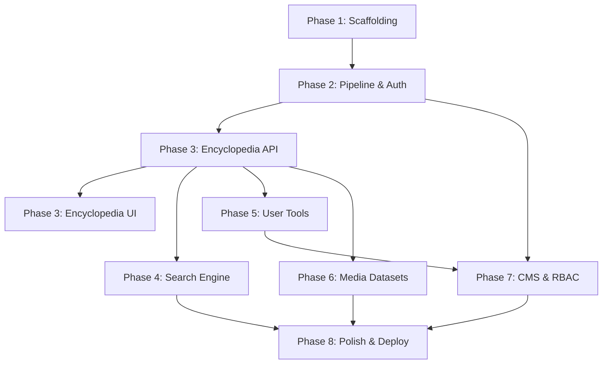

# Project Roadmap

| Document Information | |
|----------------------|------------------------------------------------|
| Document ID | PKMP-RM-001 |
| Document Name | Project Roadmap |
| Version | 1.0.0 |
| Status | Draft |
| Documentation Standard | IEEE 29148 |
| Author | Project Owner |
| Last Updated | TBD |

---

# Revision History

| Version | Date | Author | Description |
|----------|------|--------|-------------|
| 1.0.0 | TBD | Project Owner | Initial version |

---

# Table of Contents

1. Executive Summary
2. Purpose and Scope
3. Roadmap Overview
4. Detailed Phases
5. Milestone Definitions
6. Dependency Map
7. Resource Allocation and Sequencing
8. Next Steps
9. References

---

# 1. Executive Summary

This Project Roadmap outlines the strategic phased approach for the development and deployment of the Pokémon Knowledge Management Platform (PKMP). It translates the platform's vision, goals, and scope into a sequential, actionable engineering plan. The roadmap is structured into eight distinct phases, ensuring that core architectural components, security, and data integrity are established prior to building user-facing features and media integrations.

---

# 2. Purpose and Scope

The purpose of this document is to define the chronological sequence of work required to build PKMP v1.0.0. The roadmap serves as a guide for engineering sequencing, dependency management, and release planning. It spans from initial foundation setup to production deployment and final optimization.

This document does not establish exact calendar dates (which are covered in the Project Timeline) but focuses on dependencies, milestones, phase gates, and technical sequencing.

---

# 3. Roadmap Overview

The development of PKMP is structured into three primary stages:
1. **Foundation & Core (Phases 1–3):** Establishing the technical scaffolding, database schema, data validation pipeline, and core encyclopedia modules.
2. **Features & Capabilities (Phases 4–5):** Implementing the intelligent search engine, user collection tracking, team building, and comparative tools.
3. **Extensions & Polish (Phases 6–8):** Integrating supplementary media datasets (Anime, Manga, Movies, TCG), CMS editing interfaces, moderation queues, and executing final performance, accessibility, and security optimizations.

```mermaid
gantt
    title PKMP High-Level Development Phases
    dateFormat  YYYY-MM-DD
    section Stage 1: Foundation
    Phase 1: Technical Scaffolding       :active, p1, 2026-07-01, 20d
    Phase 2: Core Platform & Pipeline   :after p1, p2, 20d
    Phase 3: Encyclopedia Modules        :after p2, p3, 25d
    section Stage 2: Core Features
    Phase 4: Intelligent Search          :after p3, p4, 15d
    Phase 5: User & Collaborative Tools  :after p4, p5, 20d
    section Stage 3: Extensions & Polish
    Phase 6: Media Subsystems            :after p5, p6, 15d
    Phase 7: CMS & Administration        :after p6, p7, 15d
    Phase 8: Optimization, Security & QA :after p7, p8, 15d
```

---

# 4. Detailed Phases

## 4.1 Phase 1 — Foundation (Technical Scaffolding)
*Focus: Setting up the monorepo structure, build configurations, code styling rules, and basic CI/CD pipeline verification.*

### Key Objectives
- Initialize the PKMP monorepo structure using pnpm workspaces.
- Establish strict TypeScript configurations across all packages.
- Set up Tailwind CSS v4 styling rules and design tokens in the shared package.
- Configure ESLint, Prettier, and Husky commit hook environments.
- Verify GitHub Actions CI pipelines with a baseline check.

### Deliverables
- Fully configured monorepo repository.
- Shared development configurations (`tsconfig.json`, `.eslintrc.json`, styling tokens).
- Passing baseline CI build.

---

## 4.2 Phase 2 — Core Platform & Data Pipeline
*Focus: Developing the database schema, Prisma migration flows, backend NestJS scaffolding, user authentication mechanisms, and the JSON dataset import/validation pipeline.*

### Key Objectives
- Define the fully normalized (3NF) database schema using Prisma.
- Implement the JSON validation engine utilizing Zod schemas.
- Build the initial import pipeline to parse, validate, and seed raw datasets.
- Set up NestJS application bootstrapping, global exception filters, and response interceptors.
- Implement JWT authentication with secure refresh token rotation and cookie storage.

### Deliverables
- PostgreSQL database populated with baseline schema and seed data.
- Executable data validation scripts.
- Working `/api/auth` endpoints with authentication guards.

---

## 4.3 Phase 3 — Encyclopedia Modules
*Focus: Implementing the core read-only data modules (Pokémon, Types, Abilities, Moves, Items, Natures, Egg Groups, Regions, Games).*

### Key Objectives
- Create Prisma repositories and NestJS services for all core data entities.
- Implement REST API endpoints for paginated listing, filtering, and detail retrieval.
- Design responsive, accessible React 19 views for the encyclopedia using TanStack Router and Query.
- Integrate Three.js/React Three Fiber 3D model loaders for Pokémon detail pages.

### Deliverables
- Functional backend API endpoints for core entities.
- Fully interactive encyclopedia UI routes.
- 3D Pokémon viewer component prototype.

---

## 4.4 Phase 4 — Intelligent Search Engine
*Focus: Engineering the search module using PostgreSQL Full-Text Search (FTS), pg_trgm trigrams, query parsing, and synonym matching.*

### Key Objectives
- Set up PostgreSQL FTS indices (`tsvector`, `tsquery`) and GIN indexing for text fields.
- Configure `pg_trgm` extensions for fuzzy match fallbacks.
- Build a backend query parsing service to convert natural language fragments (e.g., "Fire-type Gen III Mega") into structured Prisma query options.
- Create UI search bar with autocomplete, instant search results, and advanced filtering sidebars.

### Deliverables
- Highly optimized search database indices.
- Search API endpoint processing complex query objects.
- Autocomplete and filter UI components.

---

## 4.5 Phase 5 — User & Collaborative Tools
*Focus: Building user-specific data tracking systems, including favorites, Living Dex tracking, team builders, and comparison matrices.*

### Key Objectives
- Implement collection tables in the database with user associations.
- Create backend endpoints for managing user collections (Living Dex, Shiny tracker, favorites) with synchronization logic.
- Design side-by-side comparison interfaces for comparing stats, move sets, and attributes of up to six Pokémon.
- Build the Team Builder tool allowing team creation, move selection, and type weakness analysis.

### Deliverables
- Authenticated collection tracking API endpoints.
- Interlocking Team Builder and Comparison UI views.
- Shared-team URL generation logic.

---

## 4.6 Phase 6 — Media Subsystems
*Focus: Extending the database schema and importing datasets for Anime episodes, Manga volumes, Movies, and TCG cards.*

### Key Objectives
- Extend the Prisma schema to accommodate media tables.
- Run the import pipeline on media datasets to populate TCG, anime, manga, and movie records.
- Implement API endpoints and UI view templates for media details and search filters.
- Connect media appearances (episodes, cards, chapters) to individual Pokémon detail pages.

### Deliverables
- Extended PostgreSQL schema with populated media tables.
- Cross-reference media lists visible on Pokémon pages.
- TCG card database visual grid view.

---

## 7.7 Phase 7 — CMS & Administration
*Focus: Implementing the admin dashboard, content management system interface, and moderation workflows.*

### Key Objectives
- Create NestJS guards and roles-based guards (RBAC) to protect administrative interfaces.
- Design the Admin Dashboard displaying platform metrics, error logs, and import statuses.
- Build CMS forms for creating and updating encyclopedia entries (with draft/publish states).
- Implement the Moderation Queue UI for reviewing community submissions.

### Deliverables
- Role-based route protection on both frontend and backend.
- Admin dashboard interface.
- CMS editing views and moderation queue.

---

## 4.8 Phase 8 — Optimization, Security & QA
*Focus: Load testing, caching configuration, performance budget checks, accessibility audits, and final production deployment configurations.*

### Key Objectives
- Implement Redis or memory-based caching for high-frequency API endpoints.
- Conduct a complete WCAG 2.2 AA accessibility audit and resolve visual or structural violations.
- Run Lighthouse audits to confirm performance budgets are satisfied.
- Configure Docker production builds and write production deployment scripts.
- Perform an OWASP ASVS compliance review.

### Deliverables
- Production-ready Docker images.
- Cache layers integrated into NestJS.
- Final testing reports (performance, accessibility, security).

---

# 5. Milestone Definitions

Milestones represent critical check-points. Passage through each milestone requires verification against defined success criteria.

| ID | Milestone | Associated Phase | Verification Criteria |
|----|-----------|------------------|-----------------------|
| MS-01 | Monorepo Bootstrap | Phase 1 | Scaffolding compiles; CI checks pass without errors. |
| MS-02 | Pipeline & Auth Complete | Phase 2 | Seed data successfully imported; JWT auth tokens rotate securely. |
| MS-03 | Encyclopedia Functional | Phase 3 | Core Pokémon/Moves/Abilities views render with real data at target performance. |
| MS-04 | Search Engine Operational | Phase 4 | Natural language search queries return relevant matches within p95 ≤ 200ms budget. |
| MS-05 | Interactive Tools Complete | Phase 5 | Team Builder and Living Dex sync to the user profile without data loss. |
| MS-06 | Media Datasets Integrated | Phase 6 | TCG cards and Anime episodes successfully cross-reference to Pokémon. |
| MS-07 | Administration Console Active | Phase 7 | Super Admin can review logs, modify roles, and moderate submissions securely. |
| MS-08 | Production Deployment Ready | Phase 8 | Docker builds compile; audits confirm WCAG 2.2 AA compliance and Lighthouse performance ≥ 90. |

---

# 6. Dependency Map

The sequence of development is restricted by technical dependencies. System modules cannot be built until their downstream dependencies are finalized.



---

# 7. Resource Allocation and Sequencing

Given the single-developer constraint (C-01), work must be sequential. No two phases should be worked on concurrently by the developer.

1. **Sequential Priority:** The developer will focus on completing Phase 1 and 2 first to ensure the API and database scaffolding are stable before UI code is written.
2. **UI Interleaving:** UI building (Phase 3 UI) starts only after the respective NestJS controllers and DTOs are finalized.
3. **Data Dependency:** Data entry and parsing scripts run before the respective module interfaces are completed, preventing developers from testing UIs with empty mock lists.

---

# 8. Next Steps

Upon approval of this Roadmap:
1. Initialize the project repository structure (Phase 1).
2. Begin drafting the detailed Project Timeline to establish duration estimates for each phase task.
3. Create the Risk Register to identify blockers that could disrupt phase delivery.

---

# 9. References

## Internal Documents

| Document | Path |
|----------|------|
| Project Charter | `docs/00_Project_Management/00_Project_Charter.md` |
| Project Context | `docs/00_Project_Management/01_Project_Context.md` |
| Vision and Goals | `docs/00_Project_Management/02_Vision_and_Goals.md` |
| Project Scope | `docs/00_Project_Management/03_Project_Scope.md` |
| Glossary | `docs/00_Project_Management/04_Glossary.md` |
| Assumptions & Constraints | `docs/00_Project_Management/05_Assumptions_and_Constraints.md` |
| Stakeholders | `docs/00_Project_Management/06_Stakeholders.md` |

---

# Next Document

```
docs/00_Project_Management/08_Project_Timeline.md
```

The Project Timeline document specifies task-level schedules, phase durations, critical path analysis, and release dates based on the phases and dependencies established in this Roadmap.
