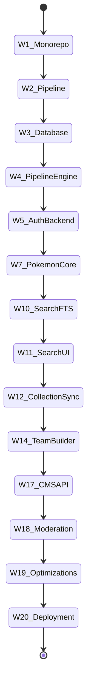

# Project Timeline

| Document Information | |
|----------------------|------------------------------------------------|
| Document ID | PKMP-TL-001 |
| Document Name | Project Timeline |
| Version | 1.0.0 |
| Status | Draft |
| Documentation Standard | IEEE 29148 |
| Author | Project Owner |
| Last Updated | TBD |

---

# Revision History

| Version | Date | Author | Description |
|----------|------|--------|-------------|
| 1.0.0 | TBD | Project Owner | Initial version |

---

# Table of Contents

1. Executive Summary
2. Timeline Parameters and Capacity
3. High-Level Schedule
4. Detailed Weekly Task Breakdown
5. Critical Path Analysis
6. Project Milestones and Phase Gates
7. Schedule Risk and Contingency Planning
8. References

---

# 1. Executive Summary

This Project Timeline details the schedule, task breakdown, critical path, and phase gates for the implementation of the Pokémon Knowledge Management Platform (PKMP) v1.0.0. Operating under the constraints of a single developer working part-time (A-01, C-01, C-02), the timeline spans a total of 20 weeks. This plan incorporates weekly task allocations, a clear critical path, and schedule buffers to manage developmental uncertainty.

---

# 2. Timeline Parameters and Capacity

The project schedule is constructed based on the following capacity assumptions:
- **Developer Resource:** 1 Project Owner (Architect / Developer / QA).
- **Weekly Capacity:** 15–20 productive hours.
- **Total Estimated Effort:** ~300–400 hours.
- **Estimated Duration:** 20 weeks (excluding major external disruptions).
- **Starting Point:** July 1, 2026.
- **Target Release Date:** November 18, 2026.

---

# 3. High-Level Schedule

The project is structured into three stages divided across 8 phases.

| Stage | Phase | Duration | Start Week | End Week |
|-------|-------|----------|------------|----------|
| **Stage 1: Foundation** | Phase 1: Technical Scaffolding | 2 Weeks | Week 1 | Week 2 |
| | Phase 2: Core Platform & Pipeline | 3 Weeks | Week 3 | Week 5 |
| | Phase 3: Encyclopedia Modules | 4 Weeks | Week 6 | Week 9 |
| **Stage 2: Core Features** | Phase 4: Intelligent Search Engine | 2 Weeks | Week 10 | Week 11 |
| | Phase 5: User & Collaborative Tools | 3 Weeks | Week 12 | Week 14 |
| **Stage 3: Extensions & Polish** | Phase 6: Media Subsystems | 2 Weeks | Week 15 | Week 16 |
| | Phase 7: CMS & Administration | 2 Weeks | Week 17 | Week 18 |
| | Phase 8: Optimization, Security & QA | 2 Weeks | Week 19 | Week 20 |

---

# 4. Detailed Weekly Task Breakdown

## 4.1 Stage 1: Foundation (Weeks 1–9)

### Week 1 — Monorepo Configuration & Shared Packages
- Initialize the pnpm monorepo workspace.
- Define shared TypeScript config files.
- Establish ESLint and Prettier configs in packages/config.
- Configure Tailwind CSS v4 variables and custom design tokens in shared styles package.
- Set up Husky pre-commit hooks for lint and commit verification.

### Week 2 — Build Pipelines & CI/CD Setup
- Create apps/web structure (React 19, Vite) and apps/api structure (NestJS).
- Set up Dockerfiles and docker-compose configurations for local development.
- Configure GitHub Actions CI workflow (linting, build verification, test runner skeleton).
- **Phase Gate MS-01:** Monorepo Bootstrap check.

### Week 3 — Database Schema & Prisma Configuration
- Design the fully normalized (3NF) relational schema for core entities (Pokémon, Types, Abilities, Moves, Items, Egg Groups, Natures).
- Write Prisma Schema file (`schema.prisma`) and generate clients.
- Run baseline database migrations locally on PostgreSQL.
- Document the schema relationship model.

### Week 4 — JSON Validation Engine & Import Pipeline
- Define Zod schemas for validating incoming raw JSON files (Pokémon, moves, abilities data).
- Write the core NestJS database seed utility and import service.
- Create automated script runners to load, parse, and commit raw datasets.
- Test import validation error reporting on bad mock payloads.

### Week 5 — Backend Bootstrap & JWT Authentication
- Configure NestJS global filters, pipes, logging, and CORS options.
- Build backend authentication module: login, register, token generation (JWT).
- Implement secure HTTP-only cookies and refresh token rotation in Redis/PostgreSQL.
- **Phase Gate MS-02:** Data Pipeline & Auth verification.

### Week 6 — Types, Natures & Egg Groups Read Services
- Create Prisma repositories and read services for Types, Natures, and Egg Groups.
- Build NestJS controllers with pagination and filter support.
- Set up frontend client routing (TanStack Router) and ReactQuery cache mechanisms (TanStack Query).
- Design simple grid/list views for types, egg groups, and natures.

### Week 7 — Pokémon Encyclopedia Core
- Implement Pokémon DB repository and detailed service interfaces.
- Write API endpoints with query param configurations.
- Build frontend list and grid layouts for Pokémon browsing.
- Set up responsive UI cards with image loading.

### Week 8 — Abilities, Moves & Items Sub-modules
- Implement repository services and API paths for Abilities, Moves, and Items.
- Build detail views for Moves and Abilities showing lists of Pokémon associated with them.
- Connect items search lists and detail view templates.

### Week 9 — 3D Viewer Integration & Advanced Details
- Integrate React Three Fiber (R3F) Canvas inside Pokémon detail views.
- Write glTF asset loader service with fallbacks to static 2D official artwork.
- Perform accessibility checks on detail view panels.
- **Phase Gate MS-03:** Core Encyclopedia verification.

---

## 4.2 Stage 2: Core Features (Weeks 10–14)

### Week 10 — PostgreSQL Full-Text Search
- Create database migration scripts to add `tsvector` column generators to Pokémon, Moves, and Items.
- Set up GIN indices on PostgreSQL search columns.
- Build NestJS Search Service wrapping Prisma query commands.
- Run performance baseline query metrics on mock data size.

### Week 11 — Natural Language Parse & Autocomplete
- Write keyword parser to detect and extract type, generation, and stat limits from string patterns.
- Implement search autocomplete API endpoints.
- Design search interface: input bar, instant query drawer, and advanced parameter sidebar.
- **Phase Gate MS-04:** Search Engine verification.

### Week 12 — User Collections & Sync Engine
- Create database schema tables for user collections (Living Dex, Favorites, Shiny tracker).
- Write collection management endpoints with authorization guards.
- Implement client collection sync logic, local storage backup, and optimistic state updates.
- Design collections management layout views.

### Week 13 — Pokémon Comparison Matrix
- Design side-by-side comparison page layouts with mobile collapse behavior.
- Implement frontend comparator services to map base stats, types, and move pools.
- Integrate bar chart comparison visualizations using canvas/SVG.

### Week 14 — Team Builder Tool
- Create Team Builder state management (React/Context or Zustand).
- Implement team stats analytics (type coverage, weaknesses, defense profile).
- Set up unique team sharing URL encryption/decryption keys.
- **Phase Gate MS-05:** Core Features verification.

---

## 4.3 Stage 3: Extensions & Polish (Weeks 15–20)

### Week 15 — Media Schema Expansion & Imports
- Expand the database schema to include Anime, Manga, Movies, and TCG set tables.
- Run import validator pipelines on media datasets.
- Implement backend read services for media datasets.

### Week 16 — Media UI Cross-References
- Design TCG card grids and Anime episode lists.
- Connect media listings as sub-tabs in Pokémon detail views.
- **Phase Gate MS-06:** Media Datasets verification.

### Week 17 — CMS Editing Panel
- Create CRUD API endpoints for managing Pokémon and Moves.
- Restrict CMS endpoints using NestJS Roles guards (RBAC).
- Build CMS frontend dashboard with rich forms (validated via React Hook Form + Zod).

### Week 18 — Moderation workflows & Auditing
- Create moderation queue tables and workflows (status transitions).
- Implement Admin Audit Log service tracking database insertions/edits.
- Design the Admin/Moderator dashboard panel with activity lists.
- **Phase Gate MS-07:** Admin and CMS verification.

### Week 19 — Caching, Audits & Bundling
- Integrate Redis/In-memory caching into high-frequency NestJS services.
- Execute Webpack/Vite analyzer checks, split bundles, and test PWA caching behavior.
- Perform WCAG 2.2 AA audit, adding necessary ARIA landmarks and key mappings.

### Week 20 — Production Deployment & Release
- Verify production Docker builds locally.
- Run OWASP ASVS dependency audits and secure API headers (Helmet, rate limits).
- Configure hosting environment (Staging/Production).
- **Phase Gate MS-08:** Launch verification and documentation freeze.

---

# 5. Critical Path Analysis

The critical path identifies tasks that directly determine the minimum duration of the project. Any delay in these tasks delays the release.



### Critical Path Elements
1. **Infrastructure Scaffolding & CI Pipeline (Weeks 1–2):** Essential for verifying deployment code.
2. **Database Normalization & Prisma setup (Week 3):** All subsequent services depend on the model schemas.
3. **Import pipeline & Zod validation (Week 4):** Development cannot proceed without data to query.
4. **Pokémon Core Module API (Week 7):** Central node of the database structure.
5. **PostgreSQL FTS and Search API (Week 10):** Foundation for interactive search views.
6. **Collection Management (Week 12):** Core user-state tracking system.
7. **CMS and Admin Access Controls (Week 17–18):** Required for data management.
8. **Deployment Configurations & Release Audits (Weeks 19–20):** Necessary for launching a stable production product.

---

# 6. Project Milestones and Phase Gates

Phase Gates prevent incomplete code from progressing. Each Gate requires verification:

1. **Gate 1 (Monorepo Bootstrap - Week 2):** Scaffolding verification. Checked via passing CI pipeline logs.
2. **Gate 2 (Pipeline & Auth - Week 5):** Core security and database readiness. Verified via JWT validation unit tests and seed verification logs.
3. **Gate 3 (Core Encyclopedia - Week 9):** Basic browse operations. Verified via Lighthouse metrics and mock user testing on local build.
4. **Gate 4 (Search Operational - Week 11):** FTS check. Verified via search latency logging (p95 ≤ 200ms).
5. **Gate 5 (User Tools - Week 14):** Data persistence check. Verified by running local storage disconnect and sync simulations.
6. **Gate 6 (Media Integrated - Week 16):** Schema check. Verified by checking FK lookup relationships in dev environment.
7. **Gate 7 (Admin & CMS Active - Week 18):** RBAC security check. Verified by running privilege bypass penetration scripts.
8. **Gate 8 (Production Deployment - Week 20):** Release validation. Verified via security audit results and PWA install tests.

---

# 7. Schedule Risk and Contingency Planning

| Schedule Risk | Impact | Contingency Action |
|---------------|--------|--------------------|
| **Data sourcing delays** (sourcing Pokemon datasets takes longer than expected) | High | Fallback to minimal data points (Generation I–III only) for the initial sprint, then run automated script loaders. |
| **Search optimization bottlenecks** (PostgreSQL FTS latency exceeds 200 ms) | Medium | Simplify the query parsing rules or drop synonym expansion in the first release, then optimize indexing. |
| **3D Rendering issues** (glTF loading fails, poor mobile performance) | Low | Disable R3F loaders by default on mobile viewports; render static high-res 2D PNG assets in place. |
| **Developer capacity shortage** (work hours drop below 15 hours/week) | High | Defer Phase 6 (Media Subsystems) to a post-v1.0.0 roadmap, freezing scope on the core Pokédex. |

---

# 8. References

## Internal Documents

| Document | Path |
|----------|------|
| Project Charter | `docs/00_Project_Management/00_Project_Charter.md` |
| Vision and Goals | `docs/00_Project_Management/02_Vision_and_Goals.md` |
| Project Scope | `docs/00_Project_Management/03_Project_Scope.md` |
| Stakeholders | `docs/00_Project_Management/06_Stakeholders.md` |
| Project Roadmap | `docs/00_Project_Management/07_Roadmap.md` |

---

# Next Document

```
docs/00_Project_Management/09_Risk_Register.md
```

The Risk Register document identifies, analyzes, and plans mitigation strategies for technical, operational, and organizational risks associated with the PKMP project.
