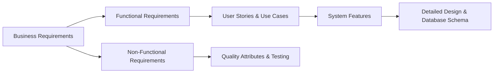

# Requirements Overview

| Document Information | |
|----------------------|------------------------------------------------|
| Document ID | PKMP-RQ-001 |
| Document Name | Requirements Overview |
| Version | 1.0.0 |
| Status | Draft |
| Documentation Standard | IEEE 29148 |
| Author | Project Owner |
| Last Updated | TBD |

---

# Revision History

| Version | Date | Author | Description |
|----------|------|--------|-------------|
| 1.0.0 | TBD | Project Owner | Initial version |

---

# Table of Contents

1. Executive Summary
2. Purpose and Scope
3. Requirements Engineering Methodology
4. Requirements Taxonomy and Hierarchy
5. Verification and Validation Approach
6. References

---

# 1. Executive Summary

This Requirements Overview establishes the framework, methodology, and taxonomy for the requirements engineering process of the Pokémon Knowledge Management Platform (PKMP). Adhering to the IEEE 29148 standard, this framework ensures that all subsequent requirements documents—spanning business, functional, non-functional, security, and module-specific domains—are structured, traceable, and implementation-ready.

---

# 2. Purpose and Scope

The purpose of this document is to define how requirements are specified, tracked, and validated throughout the PKMP development lifecycle. It serves as the introductory gate for the `01_Requirements` section of the documentation.

The scope of the requirements covers all aspects of the PKMP v1.0.0 modular monolith, including the core data model, the backend NestJS service APIs, the React 19 frontend interface, and the JSON dataset import pipelines.

---

# 3. Requirements Engineering Methodology

PKMP utilizes a structured, documentation-first requirements engineering methodology.



1. **Elicitation:** Requirements are derived from the Project Charter, Project Context, and Vision & Goals documents, balancing user expectations with architectural constraints.
2. **Specification:** Requirements are documented using a standardized taxonomy with unique IDs to ensure clear traceability.
3. **Traceability:** A Traceability Matrix connects every functional and non-functional requirement to its implementation code and corresponding test cases.
4. **Change Control:** Changes to requirements follow the Scope Change Management process defined in the Project Scope document.

---

# 4. Requirements Taxonomy and Hierarchy

To maintain consistency and traceability, all requirements are assigned a unique, hierarchical identifier using the following prefix codes:

| Prefix | Category | Description |
|--------|----------|-------------|
| **REQ-BUS-XXX** | Business Requirements | High-level organizational, educational, and portfolio goals. |
| **REQ-FUN-XXX** | Functional Requirements | Specific actions the system must perform. |
| **REQ-NFR-XXX** | Non-Functional Requirements | Quality attributes, performance budgets, and constraints. |
| **REQ-DAT-XXX** | Data Requirements | Schema, validation, and content structure requirements. |
| **REQ-SEC-XXX** | Security Requirements | Authentication, authorization, and protection requirements. |
| **REQ-ACC-XXX** | Accessibility Requirements | WCAG compliance and assistive technology requirements. |
| **REQ-PER-XXX** | Performance Requirements | Response times, bundle sizes, and query budgets. |

---

# 5. Verification and Validation Approach

Every requirement in the PKMP specification must be verifiable. The validation approach utilizes four methods:

- **Testing (T):** Automated execution of unit, integration, or end-to-end tests (e.g., Jest, Playwright).
- **Demonstration (D):** Visual execution of the user interface to verify layout, responsiveness, and usability.
- **Analysis (A):** Inspection of system logs, performance profiles, or database query plans to verify compliance with performance budgets.
- **Inspection (I):** Code review, documentation audit, or dependency check to ensure compliance with standards.

---

# 6. References

## Internal Documents

| Document | Path |
|----------|------|
| Project Charter | `docs/00_Project_Management/00_Project_Charter.md` |
| Project Context | `docs/00_Project_Management/01_Project_Context.md` |
| Vision and Goals | `docs/00_Project_Management/02_Vision_and_Goals.md` |
| Project Scope | `docs/00_Project_Management/03_Project_Scope.md` |

---

# Next Document

```
docs/01_Requirements/01_Business_Requirements.md
```

The Business Requirements document specifies the high-level business goals, educational objectives, and portfolio value requirements that drive the development of PKMP.
