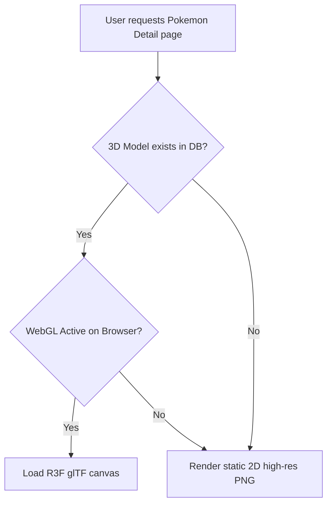

# System Features

| Document Information | |
|----------------------|------------------------------------------------|
| Document ID | PKMP-SF-001 |
| Document Name | System Features |
| Version | 1.0.0 |
| Status | Draft |
| Documentation Standard | IEEE 29148 |
| Author | Project Owner |
| Last Updated | TBD |

---

# Revision History

| Version | Date | Author | Description |
|----------|------|--------|-------------|
| 1.0.0 | TBD | Project Owner | Initial version |

---

# Table of Contents

1. Purpose and Scope
2. SF-100: Encyclopedia Explorer
3. SF-200: Advanced Search Subsystem
4. SF-300: Interactive Play & Analytics Workspace
5. SF-400: User Collection Syncer
6. SF-500: CMS Import & Seeding Utility
7. SF-600: Moderation & Audit Console
8. References

---

# 1. Purpose and Scope

This System Features document outlines the technical design, operations, inputs, and outputs of the six primary feature suites for the Pokémon Knowledge Management Platform (PKMP) v1.0.0. It bridges high-level user requirements and low-level code implementation, providing developers with clear functional expectations.

---

# 2. SF-100: Encyclopedia Explorer

## 2.1 Description and Value
The Encyclopedia Explorer is the primary view interface for browsing the Pokémon database. It allows users to explore Pokémon, moves, abilities, items, regions, and games.

## 2.2 Operational Logic & Rules
- **View Hierarchy:** All core listings default to lazy-loaded virtual lists to optimize rendering speeds.
- **Variant Toggles:** The Pokémon detail page must fetch and render alternate form tabs dynamically. Switching tabs updates the stats chart, type badges, and image links instantly.
- **3D Render Fallback:** The Three.js canvas loads only when a valid `.gltf` model reference exists in the record. If missing or if WebGL is disabled, standard high-definition official artwork displays.



## 2.3 Inputs and Outputs
- **Inputs:** URL route parameter (e.g., `/pokemon/:id_or_slug`).
- **Outputs:** Responsive multi-tab detail interface containing base stats, type charts, evolution paths, move tables, and 3D canvas panels.

---

# 3. SF-200: Advanced Search Subsystem

## 3.1 Description and Value
Provides natural language search, autocomplete suggestions, fuzzy string matches, and multi-criteria filters across the entire dataset.

## 3.2 Operational Logic & Rules
- **Tokenization:** Query strings are parsed into structured filter parameters (e.g., matching "water type" to a Type: Water filter).
- **Fuzzy Fallback:** If full-text index matching scores are low, the backend runs a fallback search using `pg_trgm` similarity scores (threshold ≥ 0.3).
- **Default Privacy:** Search results default to official franchise data. Fan-made community content only returns when the `include_community` query parameter is explicitly set to `true`.

## 3.3 Inputs and Outputs
- **Inputs:** Search input text string, filter checkbox array values.
- **Outputs:** Ranked JSON result array containing matching Pokémon, move, and ability records, along with relevance scores.

---

# 4. SF-300: Interactive Play & Analytics Workspace

## 4.1 Description and Value
Enables side-by-side Pokémon comparisons and team building, providing competitive players with type effectiveness calculations.

## 4.2 Operational Logic & Rules
- **Comparator Constraints:** Limit side-by-side comparisons to 6 active entries.
- **EV/IV Stat Sliders:** Modifying stats recalculates the Pokémon's actual stats at Level 50 and Level 100 in real time.
- **Team Weakness Logic:** Team weakness calculation processes the offensive type chart against the team's defensive type combinations. Multipliers (e.g., 4x, 2x, 0.5x, 0x) are displayed in a matrix.

## 4.3 Inputs and Outputs
- **Inputs:** Selected Pokémon list, move allocations, item options, stats allocations.
- **Outputs:** Visual stat charts, type coverage matrix maps, and compressed shareable URL strings.

---

# 5. SF-400: User Collection Syncer

## 5.1 Description and Value
Allows collectors to track their Living Dex and Favorites, ensuring synchronization between browser local storage and the PostgreSQL database.

## 5.2 Operational Logic & Rules
- **Local Storage Default:** Collection changes are saved locally to `localStorage` for guests.
- **Merge Logic:** Upon authentication, the client sends local storage changes to `/api/collections/sync`. The backend merges records (database values override local values on timestamp conflict).
- **PWA Offline Buffer:** Offline changes are queued in IndexedDB. Once a connection is detected, the queue syncs with the server.

## 5.3 Inputs and Outputs
- **Inputs:** Collection item clicks, authentication event triggers.
- **Outputs:** Updated database collection states, progress percentage indicators.

---

# 6. SF-500: CMS Import & Seeding Utility

## 6.1 Description and Value
An administrative CLI tool and dashboard UI that validates raw JSON files against Zod schemas and seeds the database.

## 6.2 Operational Logic & Rules
- **Transactional Scope:** The entire import file is parsed within a single Prisma database transaction block. Any database error triggers a complete rollback.
- **Zod Enforcement:** Imports fail immediately if a JSON object fails schema validation (e.g., missing National Pokédex number).
- **Audit Logs:** All successful imports write metadata (file name, record count, author) to the audit log table.

## 6.3 Inputs and Outputs
- **Inputs:** JSON file path, Editor authorization token.
- **Outputs:** Detailed execution logs (success count, failure line numbers, or rollback confirmation).

---

# 7. SF-600: Moderation & Audit Console

## 7.1 Description and Value
Provides administrators and moderators with tools to review user submissions, audit changes, and manage user accounts.

## 7.2 Operational Logic & Rules
- **Submission Queue:** Submitted Fakemon are saved with a `PENDING` status. They do not appear in public search results.
- **Moderator Actions:** Moderators can change a submission's status to `APPROVED` or `REJECTED` (with reason comments).
- **Audit Logs:** System writes logs for all CMS edits, role adjustments, and account suspensions.

## 7.3 Inputs and Outputs
- **Inputs:** Moderation action (approve/reject), role change command payload.
- **Outputs:** Updated submission states, audit log records, updated user permissions.

---

# 8. References

## Internal Documents

| Document | Path |
|----------|------|
| Project Scope | `docs/00_Project_Management/03_Project_Scope.md` |
| Functional Requirements | `docs/01_Requirements/02_Functional_Requirements.md` |
| Non-Functional Requirements | `docs/01_Requirements/03_Non_Functional_Requirements.md` |
| User Stories | `docs/01_Requirements/05_User_Stories.md` |
| Use Cases | `docs/01_Requirements/06_Use_Cases.md` |

---

# Next Document

```
docs/01_Requirements/08_Business_Rules.md
```

The Business Rules document defines the validation constraints, authorization levels, content separations, and data mutation boundaries for the PKMP system.
