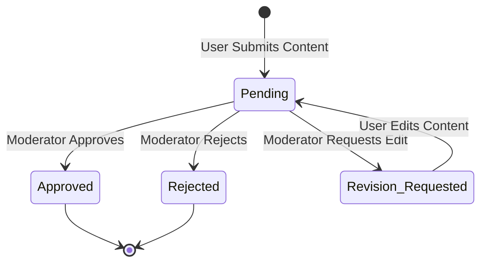

# CMS Requirements

| Document Information | |
|----------------------|------------------------------------------------|
| Document ID | PKMP-CM-002 |
| Document Name | CMS Requirements |
| Version | 1.0.0 |
| Status | Draft |
| Documentation Standard | IEEE 29148 |
| Author | Project Owner |
| Last Updated | TBD |

---

# Revision History

| Version | Date | Author | Description |
|----------|------|--------|-------------|
| 1.0.0 | TBD | Project Owner | Initial version |

---

# Table of Contents

1. Purpose and Scope
2. Official Content Management & CRUD
3. Dataset Seeding & Import Pipelines
4. Version Control and History
5. Moderation Workflow Requirements
6. References

---

# 1. Purpose and Scope

This CMS Requirements document defines requirements for the content editor panel, import validation interfaces, version control tracking, and database rollback tools of the Pokémon Knowledge Management Platform (PKMP) v1.0.0. The CMS must support bulk imports of official datasets and moderated community submissions while maintaining database integrity.

---

# 2. Official Content Management & CRUD

The CMS must provide a web interface for editors and administrators to manage official encyclopedia records.

## 2.1 Content Form Constraints
- **Form Validation:** All inputs must be validated on the client side using React Hook Form + Zod, and on the server side using NestJS validation pipes.
- **Relational Integrity:** Creating or editing a Pokémon record must prevent manual input of invalid Type, Move, or Ability references. Selection lists must be populated dynamically from database records.
- **Save States:** Forms must support a `DRAFT` status, saving records without publishing them to the public encyclopedia. Draft records are only visible to Editors, Admins, and Super Admins.

---

# 3. Dataset Seeding & Import Pipelines

The primary mechanism for populating the database with official data is the JSON dataset import pipeline.

## 3.1 Pipeline Execution Requirements

- **File Formats:** Raw datasets must be structured as JSON files.
- **Validation Checkpoints:** Imports must run a three-stage validation check:
  1. *Schema Check:* Validate the file structure and type definitions using Zod.
  2. *Reference Check:* Verify that all foreign references (e.g., move IDs) exist in the database.
  3. *Business Rule Check:* Confirm that stat values and EV allocations are within valid ranges (e.g., BR-200).
- **Error Reporting:** If a validation check fails, the pipeline must abort and report a list of errors including file name, record index, property, and validation description.

---

# 4. Version Control and History

To track data mutations, the system must maintain a version history for all official database tables.

## 4.1 Mutation Audit Log Schema

Every edit on official tables (Pokémon, Moves, Abilities, Items) must write a record to `audit_logs` containing:

| Field | Data Type | Description |
|-------|-----------|-------------|
| `id` | UUID | Unique identifier. |
| `timestamp` | Timestamp | Time of the mutation. |
| `user_id` | UUID | References the user who performed the edit. |
| `action` | Enum | The mutation type (`CREATE`, `UPDATE`, `DELETE`). |
| `table_name` | String | Target database table. |
| `record_id` | UUID | ID of the mutated record. |
| `data_before`| JSONB | State of the record before the edit (Null for CREATE). |
| `data_after` | JSONB | State of the record after the edit (Null for DELETE). |

## 4.2 Reversion Rules
- **Access Level:** Only Super Admins can trigger data reversions.
- **Execution:** Reverting an entry applies the `data_before` state of the audit log record to the target database record. Reversions are logged as a new `UPDATE` action in the audit log.

---

# 5. Moderation Workflow Requirements

The CMS must manage community submissions (Fakemon, custom guides) through a moderation workflow.



- **Moderator Dashboard:** Moderators must have access to a dashboard list showing pending submissions sorted by submission date.
- **Review Controls:** The review screen must display the submission details alongside "Approve", "Reject", and "Request Revision" buttons.
- **Feedback Loop:** Rejecting a submission or requesting a revision requires inputting a text explanation, which is sent to the submitting user's notification box.

---

# 6. References

## Internal Documents

| Document | Path |
|----------|------|
| Project Scope | `docs/00_Project_Management/03_Project_Scope.md` |
| Stakeholders | `docs/00_Project_Management/06_Stakeholders.md` |
| Functional Requirements | `docs/01_Requirements/02_Functional_Requirements.md` |
| Use Cases | `docs/01_Requirements/06_Use_Cases.md` |
| Business Rules | `docs/01_Requirements/08_Business_Rules.md` |
| Data Requirements | `docs/01_Requirements/09_Data_Requirements.md` |

---

# Next Document

```
docs/01_Requirements/12_Admin_Requirements.md
```

The Admin Requirements document defines the specifications for user account control, system health dashboard monitoring, operational logs, and data extraction tools.
