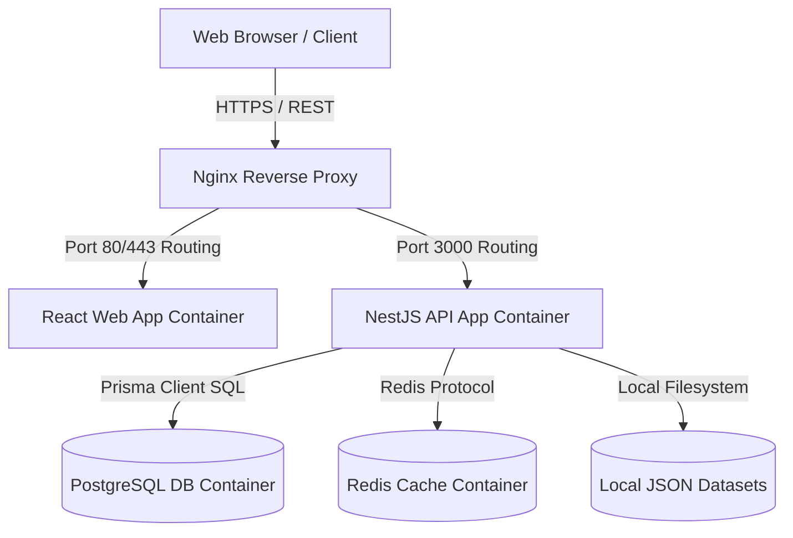
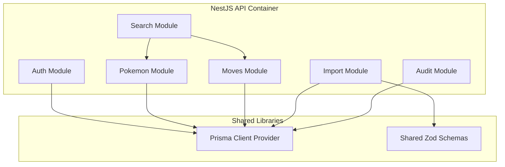

# System Architecture

| Document Information | |
|----------------------|------------------------------------------------|
| Document ID | PKMP-AR-001 |
| Document Name | System Architecture |
| Version | 1.0.0 |
| Status | Draft |
| Documentation Standard | Arc42 + C4 Model |
| Author | Project Owner |
| Last Updated | TBD |

---

# Revision History

| Version | Date | Author | Description |
|----------|------|--------|-------------|
| 1.0.0 | TBD | Project Owner | Initial version |

---

# Table of Contents

1. Executive Summary
2. C4 Level 1: System Context (Summary)
3. C4 Level 2: Container Architecture
4. C4 Level 3: Component Architecture
5. Layered Architecture (Monolith Structure)
6. Cross-Cutting Concerns
7. References

---

# 1. Executive Summary

This System Architecture document defines the structural patterns, container designs, component configurations, and layer separations for the Pokémon Knowledge Management Platform (PKMP) v1.0.0. Structured according to the Arc42 template and utilizing the C4 model notation, this specification describes how the React 19 frontend and NestJS backend integrate to form a type-safe modular monolith.

---

# 2. C4 Level 1: System Context (Summary)

As detailed in `01_Project_Context.md` (Section 15), the platform acts as a standalone knowledge hub. Users (guests, players, collectors, editors, admins) interact with the web interface, which executes requests on the self-contained database without runtime external API dependencies.

---

# 3. C4 Level 2: Container Architecture

The platform comprises four container components deployable using Docker.



## 3.1 Container Descriptions

| Container | Technology | Responsibility |
|-----------|------------|----------------|
| **Nginx Proxy** | Nginx | SSL termination, request routing, header security, and rate limiting. |
| **React Web App** | React 19, Vite, TanStack | Serves static assets, routes client views, and executes API requests. |
| **NestJS API App**| NestJS, TypeScript, Node | Processes business logic, authenticates users, runs validation, and queries DB. |
| **PostgreSQL DB** | PostgreSQL 16 | Stores normalized encyclopedia data, user records, collections, and audit logs. |
| **Redis Cache** | Redis | Caches high-frequency search listings and active user session states. |

---

# 4. C4 Level 3: Component Architecture

The backend NestJS API App container is structured as a modular monolith, where each platform domain is isolated inside a self-contained module.



- **Module Isolation:** Modules must communicate only through exported services. Direct references to another module's internal repository classes are prohibited.
- **Shared Providers:** The `PrismaModule` provides a single instance of the Prisma Client to all database-dependent modules.

---

# 5. Layered Architecture (Monolith Structure)

Each backend module follows Clean Architecture principles, separating concerns into four vertical layers.

```
┌────────────────────────────────────────────────────────┐
│                   Presentation Layer                   │
│         (Controllers, DTOs, Route Decorators)          │
├────────────────────────────────────────────────────────┤
│                   Application Layer                    │
│            (Services, Use Cases, Guards)               │
├────────────────────────────────────────────────────────┤
│                      Domain Layer                      │
│            (Entities, Interfaces, Enums)               │
├────────────────────────────────────────────────────────┤
│                  Infrastructure Layer                  │
│            (Prisma Repositories, Database)             │
└────────────────────────────────────────────────────────┘
```

1. **Presentation Layer:** Handles incoming HTTP requests, parses query parameters, and serializes JSON outputs.
2. **Application Layer:** Orchestrates business transactions, validates parameters, and manages service authorization checks.
3. **Domain Layer:** Defines database models, business logic helper objects, and data interfaces.
4. **Infrastructure Layer:** Implements concrete database adapters and external filesystem tools.

---

# 6. Cross-Cutting Concerns

- **Error Handling:** A global Exception Filter intercepts all backend errors and maps them to standard JSON formats (API-4.1).
- **Authentication Guard:** A global JWT Guard intercepts requests on protected routes, validates token validity, and binds user payload context to the request.
- **Logging:** NestJS custom logger records request times, SQL executions, and unhandled system errors to standard output stream formatting.

---

# 7. References

## Internal Documents

| Document | Path |
|----------|------|
| Project Context | `docs/00_Project_Management/01_Project_Context.md` |
| Project Scope | `docs/00_Project_Management/03_Project_Scope.md` |
| Decision Log | `docs/00_Project_Management/10_Decision_Log.md` |
| Data Requirements | `docs/01_Requirements/09_Data_Requirements.md` |
| Database Requirements | `docs/01_Requirements/18_Database_Requirements.md` |
| Integration Requirements | `docs/01_Requirements/20_Integration_Requirements.md` |

---

# Next Document

```
docs/02_Architecture/Component_Design.md
```

The Component Design document specifies the internal module configurations, NestJS controller mappings, and React view component trees for the platform.
