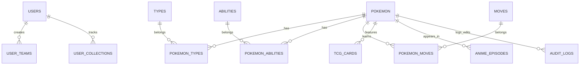

# Schema Design

| Document Information | |
|----------------------|------------------------------------------------|
| Document ID | PKMP-SD-002 |
| Document Name | Schema Design |
| Version | 1.0.0 |
| Status | Draft |
| Documentation Standard | IEEE 29148 + Prisma |
| Author | Project Owner |
| Last Updated | TBD |

---

# Revision History

| Version | Date | Author | Description |
|----------|------|--------|-------------|
| 1.0.0 | TBD | Project Owner | Initial version |

---

# Table of Contents

1. Purpose and Scope
2. Database Schema Diagram (ERD)
3. Prisma Schema Model Specifications
4. Database Tables & Column Details
5. References

---

# 1. Purpose and Scope

This Schema Design document defines the database tables, fields, constraints, data types, and Prisma ORM configurations for the PostgreSQL database of the Pokémon Knowledge Management Platform (PKMP) v1.0.0. The schema enforces Third Normal Form (3NF) to ensure data consistency.

---

# 2. Database Schema Diagram (ERD)

The entity relationships are structured as follows:



---

# 3. Prisma Schema Model Specifications

The database models are configured in `schema.prisma`.

## 3.1 User & Auth Models

```prisma
enum Role {
  USER
  MODERATOR
  EDITOR
  ADMIN
  SUPERADMIN
}

model User {
  id           String           @id @default(dbgenerated("gen_random_uuid()")) @db.Uuid
  username     String           @unique @db.VarChar(30)
  email        String           @unique
  passwordHash String           @map("password_hash")
  role         Role             @default(USER)
  createdAt    DateTime         @default(now()) @map("created_at")
  updatedAt    DateTime         @updatedAt @map("updated_at")
  teams        UserTeam[]
  collections  UserCollection[]

  @@map("users")
}
```

---

## 3.2 Core Encyclopedia Models

```prisma
model Pokemon {
  id             String             @id @default(dbgenerated("gen_random_uuid()")) @db.Uuid
  nationalNum    Int                @unique @map("national_num")
  slug           String             @unique
  name           String             @db.VarChar(100)
  baseHp         Int                @map("base_hp")
  baseAttack     Int                @map("base_attack")
  baseDefense    Int                @map("base_defense")
  baseSpAttack   Int                @map("base_sp_attack")
  baseSpDefense  Int                @map("base_sp_defense")
  baseSpeed      Int                @map("base_speed")
  height         Float
  weight         Float
  genderRatio    Float              @map("gender_ratio")
  catchRate      Int                @map("catch_rate")
  baseExp        Int                @map("base_exp")
  sourceType     String             @default("OFFICIAL") @map("source_type")
  searchVector   Unsupported("tsvector")? @map("search_vector")
  createdAt      DateTime           @default(now()) @map("created_at")
  updatedAt      DateTime           @updatedAt @map("updated_at")
  types          PokemonType[]
  abilities      PokemonAbility[]
  moves          PokemonMove[]
  tcgCards       TcgCard[]

  @@index([searchVector], type: Gin)
  @@map("pokemon")
}
```

---

# 4. Database Tables & Column Details

Detailed schemas for the relational join tables:

## 4.1 `pokemon_types` Table
Maps the relationship between Pokémon and types.

- `pokemon_id` (UUID, Foreign Key -> `pokemon.id`, Not Null)
- `type_id` (UUID, Foreign Key -> `types.id`, Not Null)
- `slot` (Integer, Range: 1–2, Not Null): Marks primary vs. secondary types.
- **Constraints:** Primary Key (`pokemon_id`, `type_id`), Index on `type_id`.

## 4.2 `pokemon_abilities` Table
Maps the relationship between Pokémon and abilities.

- `pokemon_id` (UUID, Foreign Key -> `pokemon.id`, Not Null)
- `ability_id` (UUID, Foreign Key -> `abilities.id`, Not Null)
- `is_hidden` (Boolean, Not Null, Default: false): Markshidden abilities.
- **Constraints:** Primary Key (`pokemon_id`, `ability_id`), Index on `ability_id`.

---

# 5. References

## Internal Documents

| Document | Path |
|----------|------|
| Project Scope | `docs/00_Project_Management/03_Project_Scope.md` |
| Decision Log | `docs/00_Project_Management/10_Decision_Log.md` |
| Data Requirements | `docs/01_Requirements/09_Data_Requirements.md` |
| Database Requirements | `docs/01_Requirements/18_Database_Requirements.md` |
| System Architecture | `docs/02_Architecture/System_Architecture.md` |

---

# Next Document

```
docs/03_Database/Relational_Mappings.md
```

The Relational Mappings document defines relational schemas, joining keys, cascade constraints, and custom indexes.
